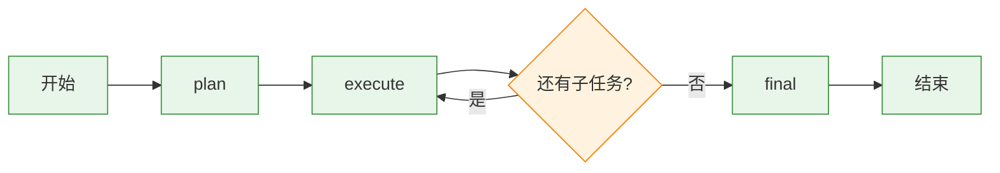
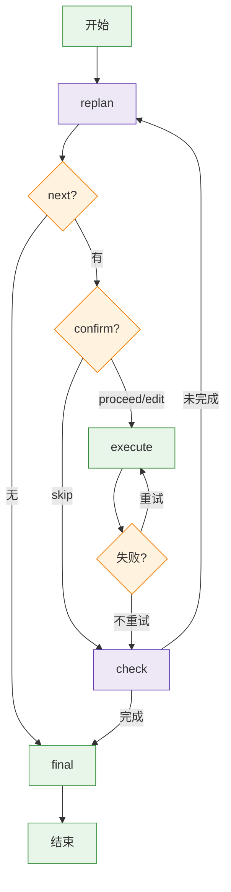

# 自主任务 Agent（独立仓库 agentchat-task-agent）

> 相关文档：见 [文档地图](README.md)；独立仓库见 [github.com/Zhuliqx/task-agent](https://github.com/Zhuliqx/task-agent)。
> 最后校验：2026-08-29（文档与当前代码同步；防漂移检查见 `backend/scripts/check_docs_stale.py`）
> 区别于主项目（Agentchat 的知识库问答/单轮路由）。这是一个**自主任务执行器**：
> 接收模糊目标 → LLM 分解/每步重规划 → 循环执行（宿主注入执行器，复用现有子 Agent）→ 结构化交付。
> 引擎本体是独立 Python 包/独立仓库（发行名 `agentchat-task-agent`，零 `app.*` 依赖），主项目通过
> `backend/app/agents/task_agent_adapter.py` 注入 LLM / Checkpointer / `run_agent` 执行器。

## 1. 与主项目的区别

| | 主项目（supervisor） | 本模块（task_agent） |
|--|--------------------|--------------------|
| 驱动 | 用户单轮提问 | 模糊复杂目标 |
| 执行模式 | ReAct 单循环 | `fixed`(一次性计划) / **`replan`(每步重规划)** |
| 视野 | 单步 | 多步规划（子任务列表/动态决策） |
| 交付 | 直接回答 | 综合多个子结果的结构化交付 |

## 2. 架构（LangGraph StateGraph）

两种模式共用 `TaskState`：`findings` 用 `Annotated[list, _append_findings]` **reducer 增量合并**（节点只回新增片段）。

### fixed（一期：Plan → Execute → Final）

- **plan_node**：LLM 拆成 2~8 个子任务（JSON），解析失败回退“单子任务=直接回答”；
- **execute_node**：对当前子任务调用一次现有 supervisor（复用 rag/mcp/web_search/code），结果追加进 findings；
  单子任务异常不中断（标记 failed 继续）；
- **final_node**：整合所有 findings 输出交付。

### replan（二期：每步重规划）+ 三期节点机制（默认）

- **replan_node**：基于 goal + findings 每步动态决定下一步动作 + 标注 `expected_source`(kb/db/web/code)；新动作时重试计数归零；
- **confirm_node（节点级 HITL）**：replan 产出下一步后 `interrupt` 让用户确认（proceed/edit/skip）；依赖 Postgres checkpointer，未连库自动降级全自主；`TASK_AGENT_HITL=false` 也可关；
- **execute_action_node**：按 `expected_source` 收紧开关 + 前缀引导（设计 A）；失败返回 finding（不计重试次数），重试计数保留；
- **verify_node（自检重试）**：子任务失败(失败/无输出)后 LLM 判是否值得重试，未达 `TASK_AGENT_MAX_RETRIES` 则回 execute（不计步数），否则放弃进 check；
- **check_node**：判定是否充分达成 + `config.max_steps` 规则兜底防循环；
- **final_node**：整合所有 findings 输出交付。

### 节点级 fault tolerance（LLM 节点）
- **`retry_policy`**：`RetryPolicy(max_attempts=2, retry_on=_is_transient)`——网络/连接/超时/5xx/限流重试，确定性错误（ValueError 等）不重试（避免对必然失败浪费调用）；
- **`timeout`**：节点超时 = `llm_timeout * (llm_max_retries + 1)`，给客户端重试留足空间、仍有硬上限；
- **`error_handler`**：重试耗尽后降级，返回 **`Command(update, goto)`** 才能续跑；每节点最多一个。
- 例外：`execute`/`execute_action` 是“业务子任务”（失败标记 finding → 交 verify 语义重试），**不参与**上述 retry/timeout/error_handler。

## 3. 接口缝与宿主注入
- 包内定义 `TaskAgentConfig` / `LLMFactory` / `CheckpointerProvider` / `Executor(ExecuteRequest -> StepResult)`
  四个接口缝，另有可选 `on_event`（事件回调）与 `memory`（跨任务记忆），`build_agent(...)` 注入后返回编译图；
- 宿主适配器：LLM 工厂 `get_llm("light")`、工具/子 Agent（rag/mcp/web_search/code）作执行器
  （`run_agent` 包装，按 `expected_source` 收紧开关）；
- **Checkpointer**（长任务可中断/恢复 + HITL + Time Travel）；无 checkpointer 自动降级无状态；
- **跨任务记忆**：`get_store()` 就绪时注入 `_HostMemory`（namespace=(user, "task_memories")），
  任务开始召回历史结论、结束沉淀 final_answer；Store 不可用时降级无记忆；
- **事件回调**：`build_host_task_agent(on_event=...)` 透传执行过程事件，路由接 SSE；
- 可观测（Langfuse）与评估基建（FakeLLM 单测 + judge）由宿主提供。

## 4. API 与关键配置
- `POST /api/agent-tasks/run`：`{goal, session_id?, checkpoint_id?, checkpoint_ns?}`——新建任务，或带 `checkpoint_id` 分叉(带 goal)/重放(无 goal)；
- `POST /api/agent-tasks/run/stream`：SSE 事件流——实时推送 plan/replan/execute/check/verify/hitl/final，最后推 result；
- `POST /api/agent-tasks/confirm`：`{session_id, verb, action?, source?}`——HITL 恢复（Command(resume)）；
- `POST /api/agent-tasks/history`：`{session_id, limit}`——Time Travel 列 checkpoint 历史；
- 配置：`TASK_AGENT_MODE=fixed|replan`(默认 replan)、`TASK_AGENT_HITL=true`(默认，无库降级)、
  `TASK_AGENT_MAX_RETRIES=2`、`TASK_AGENT_MAX_STEPS=8`。

## 5. 已验证
- 真实 LLM 跑通：目标「示例科技有限公司成立于哪一年」→ 信息源感知选 **kb** → 知识库检索出 2020/北京/company.md；
- **节点级 HITL** 真实链路：interrupt → `Command(resume=proceed)` → 继续执行完成；
- **verify 自检重试**：子任务失败 → verify 判重试 → 重试成功（findings 同时留失败+成功记录）；
- **Time Travel 分叉**：从历史 checkpoint 改用新 goal → `update_state` → 续跑新分支；
- **fault tolerance**：LLM 网络错误被 `_is_transient` 重试，error_handler 降级收敛兜底；
- 单元测试位于独立仓库 `task-agent/tests/`（覆盖解析/路由/HITL/verify/error_handler/TimeTravel 无库降级 + demo 离线全流程），
  另有宿主适配器单测（source→开关映射 / 图缓存 / on_event 绕过缓存 / 记忆降级）；全量单测通过 + Ruff 干净。

## 5.1 深度 / 广度扩展（2026-08）
- **事件流**：`on_event` 全生命周期事件（plan/replan/execute/check/verify/hitl/final），宿主路由已接 SSE（`/api/agent-tasks/run/stream`）；
- **findings 压缩**：`TaskAgentConfig(findings_budget=N)` 超限把历史压进 `findings_summary`，控制长任务上下文与 token 成本；
- **任务级评估**：包内 `task_agent.judge`（LLM-judge：目标达成/信息完整/幻觉，0-1）；宿主脚本
  `backend/scripts/eval_task_agent.py` 跑真实 LLM + judge；
- **工具执行器**：包内 `ToolCallingExecutor` + 内置 calculator/time/random（零依赖）；宿主执行器仍走 supervisor
  （工具能力更全），接口缝不变；
- **CLI 与基准**：`task-agent` CLI（run/demo）+ `benchmarks/bench_task_agent.py`（fixed vs replan，含 LLM-judge）；
- **发布**：发行名 `agentchat-task-agent`（import 名 `task_agent`），TestPyPI 已验证安装。

## 6. 分期
- ✅ **一期**：`fixed` Plan → Execute → Final + API；`TASK_AGENT_MODE=fixed`；
- ✅ **二期**：`replan` 每步动态重规划 + 独立 `check` 判完成 + `max_steps` 防循环；
- ✅ **信息源感知（L1+L2）**：replan 标注 `expected_source`，执行按源收紧开关 + 前缀引导——公司/产品优先知识库；
- ✅ **三期**：节点级 HITL（confirm_node）+ 节点容错（verify_node）+ 状态 reducer；
- ✅ **节点级 fault tolerance**：`retry_policy` + `timeout` + `error_handler`(Command) + 自定义 `retry_on`；
- ✅ **Time Travel 长任务恢复**：`list_task_history` + `run` 支持 `checkpoint_id` 分叉/重放；
- ✅ **流式(SSE) 接入**：`/api/agent-tasks/run/stream` 实时事件流；
- ⬜ 待办：前端展示执行过程。
