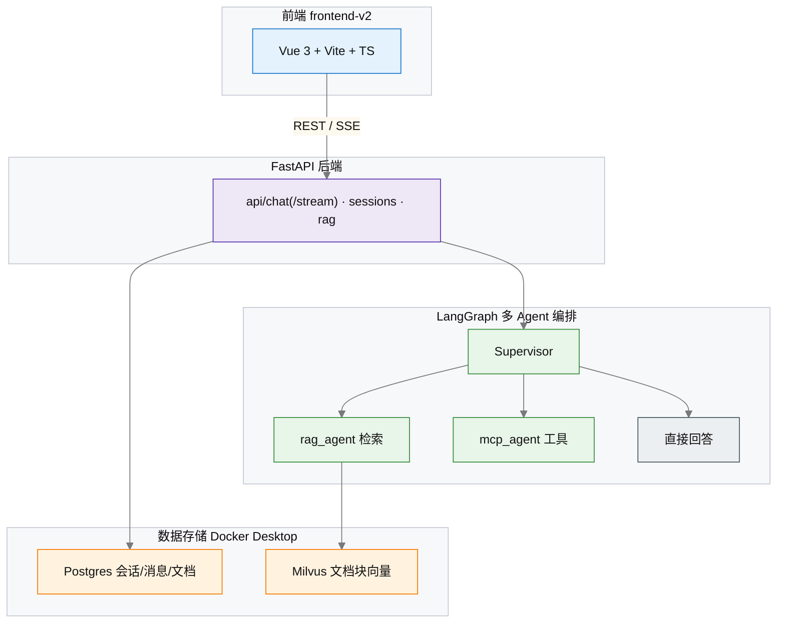
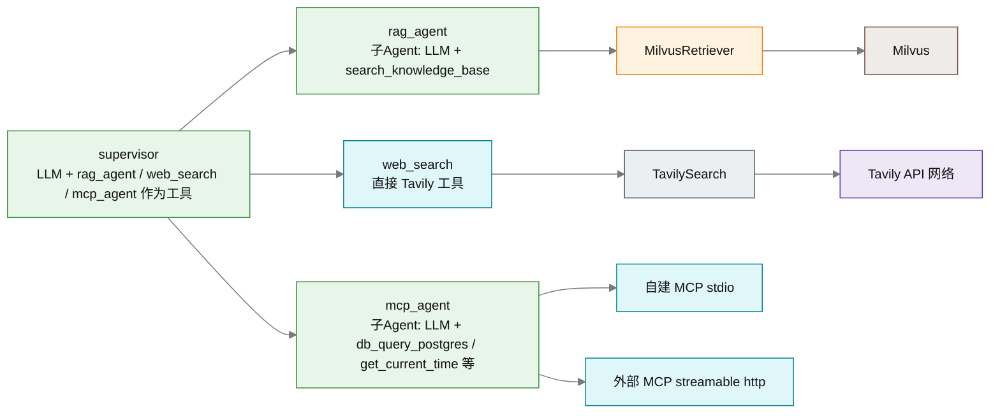
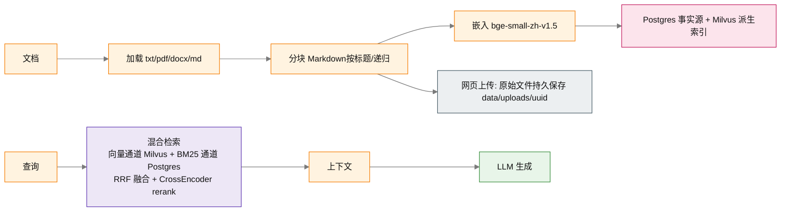
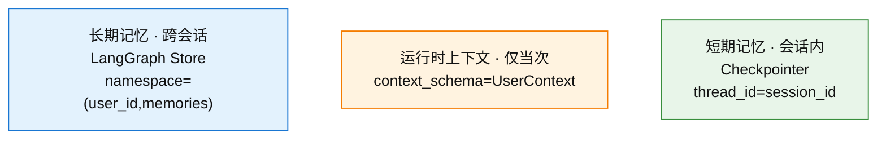

# 系统架构

> 最后校验：2026-08-29（文档与当前代码同步；防漂移检查见 `backend/scripts/check_docs_stale.py`）

## 1. 文档地图（本仓库两个项目）

> 本仓库含**两个独立项目**，共享底层 LLM 工厂 / 工具 / 子 Agent / Checkpointer / 评估 / Langfuse。
> 完整文档清单、文档状态与**唯一基线数字**见 [docs/README.md](README.md)。

| 项目 | 定位 | 文档 |
|------|------|------|
| **项目 1 · Agentchat**（本文档主线） | FastAPI + LangGraph + LangChain 的多 Agent 平台（RAG+MCP+三层记忆+HITL+Time Travel） | [文档地图](README.md) |
| **项目 2 · 自主任务 Agent**（独立仓库，发行名 `agentchat-task-agent`） | 接收模糊目标 → LLM 分解/每步重规划 → 循环执行 → 结构化交付；经宿主适配器注入项目 1 子 Agent | [AGENT_TASK](AGENT_TASK.md) |

- **代码结构**：`backend/app/`（项目 1 主体）+ 独立仓库 `agentchat-task-agent`（项目 2）；前端 `frontend-v2/`。

## 2. 总览



## 3. 组件说明

| 组件 | 技术 | 职责 |
|------|------|------|
| Web 框架 | FastAPI + uvicorn | REST API、托管前端构建产物（dist）、CORS |
| 前端 | Vue 3 + Vite + TypeScript + Tailwind CSS 4 + Pinia | 聊天界面、侧边栏（会话/文档/记忆）、SSE 流式渲染、弹窗、主题切换（dark/light）；`frontend-v2/` |
| Agent 编排 | LangGraph / LangChain (`create_agent`) | Supervisor 层级多 Agent（官方 subagents 模式），子 Agent 作为工具被调度 |
| Agent 能力 | LangChain (LCEL / tools / retriever) | LLM 调用、工具协议、检索器接口 |
| 向量库 | Milvus + pymilvus | 文档块向量存储与相似度检索；source 标量索引加速删除/过滤 |
| 检索 | 向量 + BM25 + RRF 混合检索；CrossEncoder rerank；查询改写（rule/llm，可开关） | 两路召回融合 + 精排 + 可选改写，提升召回与 top-k 质量 |
| 关系库 | PostgreSQL + SQLAlchemy | 会话、消息历史、文档元数据（BM25 文本源） |
| 记忆 | LangGraph Checkpointer + Store（Postgres） | 短期=thread 状态；长期=跨线程 namespace |
| 嵌入 | sentence-transformers / OpenAI | 文本向量化（默认 `bge-small-zh-v1.5`） |
| 联网搜索 | Tavily (`langchain-tavily`) | 直接 Tavily 搜索工具（非子 Agent），Supervisor 单次调用后自行总结 |
| MCP | `mcp` SDK (FastMCP + stdio/http client) | 自建工具服务器 + 外部 MCP 接入 |
| LLM | DeepSeek / DashScope / OpenAI / Ollama | 默认 DeepSeek，可切换 |

## 4. 多 Agent 设计（Supervisor 模式）

### 4.1 Supervisor 层级模式

采用**层级式（Hierarchical）**架构，`supervisor` 本身是一个 ReAct Agent，
它持有多个"子 Agent 工具"——这正是 LangGraph 官方文档的
**subagents 模式**（"wrap a subagent as a tool"）：

- `rag_agent`：检索知识库并生成回答（RAG 专用，子 Agent）
- `web_search`：联网搜索——**直接 Tavily 工具**（非子 Agent，避免子 Agent 内部多轮搜索造成 ~20s 延迟）
- `mcp_agent`：调用所有已连接的 MCP 工具（数据库查询、时间等，子 Agent）

Supervisor 根据用户意图自主决定调用哪个工具、调用几次，或直接回答。
`rag_agent` / `mcp_agent` 内部是独立的 ReAct 循环（调用检索器 / MCP 工具），
因此可以**任意组合多步工具调用**，而不需要硬编码路由；
`web_search` 则退化为直接工具：单次 Tavily 调用即返回结果，由 Supervisor 自行总结，
搜索环节从 ~20s+（子 Agent 实测触发 4 次 Tavily + 3 次 LLM）降到 ~2s。



### 4.2 动态提示词与开关联动

> **提示词动态化**：supervisor 的 system prompt 由 `build_supervisor_prompt(use_rag, use_search, use_memory)`
> （定义于 `app/agents/prompts.py`）
> **按开关动态生成**——关闭知识库/搜索/记忆时，提示词同步移除对应工具描述并明确禁止调用，
> 避免 LLM 幻觉调用不存在的工具（曾导致"关闭开关仍显示调用 rag_agent"的假象）。

## 5. RAG 流程



- **原始文件存储**：网页上传的文档持久保存到 `data/uploads/<uuid>/<文件名>`（不再用临时目录），
  `source` 即该路径；提供 `GET /api/rag/documents/file?source=...` 在线预览/下载（仅限 uploads 目录，防任意文件读取）；删除文档时一并清理原始文件。
  本地 CLI 摄入（`ingest_docs.py`）保留原文件位置，不复制。

- **分块**：Markdown 文档先按标题层级（H1/H2/H3）切分再递归分块，每块携带章节标题元数据；普通文本按段落/句号/感叹号/问号切分。
- **混合检索**：向量通道（Milvus 语义相似度）+ 关键词通道（Postgres 全文文本上的轻量 BM25，中文字符+英文单词切分），用 RRF（Reciprocal Rank Fusion）融合——交集项获得双路加分，兼顾语义相近与术语精确命中。
- **rerank**：融合后的 Top-N 候选经 `bge-reranker-base`（CrossEncoder）交叉编码精排，输出最终 top-k。
- **跨库一致性**：Postgres 为事实源（`vector_status` pending/synced 标记），Milvus 用幂等
  `sync_chunks`（按 doc_id 删+插）同步；`reconcile_vectors` 对账任务清理幽灵向量/补缺失块。

## 6. MCP 架构

```
                 backend/app/mcp_integration/
                 ├── client.py              # 连接管理器（stdio + http）
                 │     ├── 自建服务器启动（子进程）
                 │     └── 外部服务器连接（streamable_http_client）
                 └── servers/
                     ├── db_query_server.py # 自建：Postgres 只读查询
                     └── time_server.py     # 自建：时间 / 计算
```

- 自建 MCP 通过 **stdio** 以子进程方式拉起（FastMCP 实现）。
- 外部 MCP 通过 `EXTERNAL_MCP_SERVERS` 环境变量配置（JSON `{"name": "url"}`，兼容旧 `name=url` 逗号格式），用 **streamable http** 连接。
- 所有 MCP 工具会被转换为 LangChain `StructuredTool`（工具名加服务器前缀，避免冲突），供 MCP Agent 使用。

## 7. 记忆架构（三层，LangGraph 官方机制）

### 7.1 三层总览



### 7.2 短期记忆（Checkpointer）

- **短期记忆**：`create_agent(..., checkpointer=AsyncPostgresSaver)` 编译，
  调用时 `config={"configurable": {"thread_id": session_id}}`，图状态（含历史 messages）跨请求持久化。
### 7.3 运行时上下文

- **运行时上下文**：`create_agent(..., context_schema=UserContext)` 定义上下文类型，
  调用时 `context=UserContext(user_id=..., session_id=...)` 传入；**仅当次调用有效、不持久化**。
  节点/工具通过 `Runtime` 对象（工具内 `get_runtime()`）访问 `runtime.context`。
### 7.4 长期记忆（Store，含语义检索与去重）

- **长期记忆**：`create_agent(..., store=AsyncPostgresStore)`，工具通过
  `runtime.store`（`aput`/`asearch`）按 namespace `(user_id, "memories")` 读写，
  跨线程、跨进程持久；`/api/memory` 与前端记忆面板由 Store 支撑。
  - **语义检索**：Store 初始化时尝试挂载 `IndexConfig`（复用 bge embedding），
    `asearch(..., query=...)` 按语义相似度召回；需 Postgres 启用 pgvector，缺失时自动降级关键词检索。
  - **写入去重**：`remember_memory` 先按语义检索已有记忆，余弦相似度 ≥ 阈值（默认 0.86）则更新该条而非新增，避免重复。

## 8. 流式输出（SSE）

聊天接口提供两个端点：

| 端点 | 说明 |
|------|------|
| `POST /api/chat` | 非流式：一次性返回答案 + 事件列表（兼容旧客户端 / 冒烟测试） |
| `POST /api/chat/stream` | SSE **token 级流式**：`start/agent/tool/end/interrupt` 事件实时推送；`token` 帧逐段推送 supervisor 答案文本；`message` 帧作最终一致快照（含 `session_id` / `used_agents`） |

Token 级流式基于 `graph.astream(stream_mode=["updates", "messages"])`：
- `updates` 模式识别工具调用/子 Agent 调度 → 发 `tool`/`agent` 事件；命中 `__interrupt__` 节点 → 发 `interrupt` 事件（HITL，携带待确认问题 + `session_id`）。
- `messages` 模式产出 `(AIMessageChunk, metadata)`；仅接受**顶层 supervisor**（`checkpoint_ns` 不含 `|`）的 AI 文本 token，子 Agent 的嵌套命名空间（`model:xx|mcp_agent:xx`）被跳过，避免中间输出混乱。
- **开场白缓冲 + 去重**：工具调用前的开场白 token 先缓冲，检测到 `tool_call` 时一次性推送完整开场白（避免半句/悬停）；工具后的答案流经 `_PreludeDedupe` 前缀去重（LLM 常重新生成完整开场白），保证"开场白 + 答案"无缝衔接。

同步 DB 调用（会话/消息/历史）通过 `anyio.to_thread` 放入线程池，避免阻塞事件循环——
这是"不改 ORM 为异步"的轻量方案（SQLAlchemy 保持同步，热点路由不卡 IO）。

## 9. 健壮性（超时 / 重试）

- **请求超时**：`run_agent`/`stream_agent` 外层 `asyncio.timeout(agent_timeout=120s)`，LLM/MCP 卡死时返回 504，不无限挂起。
- **多轮历史**：每次请求只传当前消息，历史由 Checkpointer 按 `thread_id` 自动恢复（不再手动拼接/裁剪；长对话可新建会话归档）。
- **LLM 重试/超时**：所有 OpenAI 兼容 provider（DeepSeek/DashScope/OpenAI）统一 `timeout`（60s）+ `max_retries`（2），网络抖动自动重试。
- **模型预热**：rerank 模型在应用启动后后台线程预热，避免首个 RAG 请求卡顿（首次需下载约 1.1GB）。
- **rerank 候选受限**：仅对 `rerank_candidate_k`（默认 6）条候选精排，输入按 `rerank_max_length` 截断，控制 CPU 推理量。
- **数据库索引**：`sessions.updated_at` / `documents.created_at` 建 DESC 索引，`init_db()` 幂等补建，加速会话/文档列表排序。

## 10. 数据流（一次对话，SSE token 级流式）

1. 前端 `POST /api/chat/stream`（SSE），携带 `session_id` 与消息。
2. 后端（线程池）保存用户消息到 Postgres，随后调用 `stream_agent()`（历史由 Checkpointer 从 `thread_id` 自动恢复，无需手动组装）。
3. `stream_agent` 基于 `graph.astream(stream_mode=["updates","messages"])` 执行：
   - `updates` 识别工具/子 Agent 调用 → 通过 `on_event` 推送 `start/agent/tool/end` 事件到 SSE 队列。
   - `messages` 产出 supervisor 的 token → 通过 `on_token` 推送 `token` 帧，前端实时渲染。
4. supervisor 决策 → 调用 `rag_agent` / `mcp_agent`（子 ReAct 循环，内部走混合检索 + rerank）→ 流式输出答案。
5. **HITL 分支**：若命中需人工确认的动作（`confirm_before` / 主动 `request_confirmation`），图在 `interrupt` 处暂停，SSE 推 `interrupt` 事件（不推 `message` 帧）；前端弹确认卡片，用户选择后以 `resume=confirmed|cancelled` 重发（同一 `session_id`/`thread_id`），`Command(resume)` 从断点继续。
6. 后端保存 assistant 消息，SSE 推送 `message` 帧（最终一致快照，含 `session_id` / `used_agents`）。
7. 会话 `updated_at` 同步刷新，活跃会话自动排到列表最前（`sessions.updated_at` 已建索引）。

## 11. 人工确认（HITL，Human-in-the-Loop）

基于 LangGraph `interrupt` / `Command(resume)` 官方机制，让用户在关键操作（联网搜索、外部工具、写入等）前拍板：

1. **`confirm_before` 强制确认**（`app/agents/tools/confirmation.py`）：`agent_to_tool(..., confirm_before=...)` 包装的子 Agent，在真正执行前先 `interrupt({...})` 暂停图，返回 `__interrupt__`；只有用户回 `confirmed` 才继续，否则返回"操作已取消"。
   - 配置：`HITL_ENABLED=true`；`HITL_ACTIONS` 为空时默认 **LLM 自主判定**（`request_confirmation`，由模型决定何时请求授权，类似 Claude Code/Codex）；非空（如 `mcp`）时为**强制确认**（调用前无条件 interrupt）。
   - **开关豁免**：强制确认模式下，有前端开关的动作（search/rag/remember）在开关打开时自动豁免（开关即授权）。
2. **`request_confirmation` 软性确认**：当 `HITL_ACTIONS` 为空时注册，prompt 强约束 supervisor 对联网搜索/外部工具调用**先请求确认**（问题由 supervisor 生成；避免与强制确认叠加成双重确认）。
3. **中断后恢复**：`run_agent`/`stream_agent` 支持 `resume` 参数，非空时用 `Command(resume=resume)` 从上次 `interrupt` 断点继续（同一 `thread_id`），不再重复传入问题、不重复保存用户消息。
4. **前端交互**（`frontend-v2`）：`stores/chat.ts::_handleEvent` 收到 `interrupt` 事件在气泡内渲染确认卡片（问题 + 确认/取消按钮）→ 点击后 `resume(choice, sessionId)` 复用同一消息以 `resume=confirmed|cancelled` 重发 `/api/chat/stream` → 同一气泡继续渲染后续 token/答案。

## 12. 核心文件映射

| 文件 | 职责 |
|------|------|
| `app/main.py` | FastAPI 入口：生命周期初始化 + MCP 启动 + 模型预热 + 路由挂载 |
| `app/config.py` + `config_sections.py` | 配置中心（pydantic-settings，字段按域分组，`.env`） |
| `app/agents/graph.py` | Supervisor 图构建缓存；`run_agent`（非流式）/ `stream_agent`（token 流式）；提示词在 `prompts.py`、流式去重在 `streaming.py` |
| `app/agents/tools/` | 工具族包：rag_tool / mcp_tool / search_tool / code_tool / memory_tools / confirmation / sources / text |
| `app/agents/task_agent_adapter.py` | 项目 2 宿主适配器（向独立包 `agentchat-task-agent` 注入 LLM / Checkpointer / `run_agent` 执行器） |
| `app/agents/llm.py` | LLM 工厂（provider 选择 + 超时/重试） |
| `app/rag/vector_store.py` | MilvusClient 单例：schema/索引/检索/维度校验/`sync_chunks` 幂等同步/`query_source_pairs` 对账查询 |
| `app/rag/bm25.py` | 轻量 BM25 索引（中英文切分，无第三方依赖） |
| `app/rag/hybrid.py` | 向量 + BM25 + RRF 混合检索融合 |
| `app/rag/rerank.py` | CrossEncoder 精排（候选受限 + 输入截断） |
| `app/rag/query_rewrite.py` | 查询改写（rule/llm + 精确词豁免 + 拒绝词回退，默认关） |
| `app/rag/prompt_injection.py` | Prompt 注入防护（不可信数据块隔离 / 规则检测剔除 / LLM 复核 / 输出泄露检测） |
| `app/security.py` | 密码（PBKDF2）/ JWT（HS256） |
| `app/rag/ingestion.py` | 摄入编排（解析在 `extractors/`、分块在 `chunkers.py`；PG 先行 + 状态标记 + 幂等同步） |
| `app/rag/postprocess.py` | 检索后处理纯函数（去重合并/近似去重/预算/截断，供 retriever 组装） |
| `app/scheduler.py` | 定时任务调度器（含 `reconcile_vectors` 向量对账任务） |
| `app/db/postgres.py` | 会话/消息 CRUD + 幂等建索引 |
| `app/db/memory_store.py` | Checkpointer / Store 全局单例（语义索引自动降级） |
| `app/api/routes/chat.py` | 非流式 + SSE token 级流式端点 |
| `app/api/routes/rag.py` | 上传（原始文件持久化）/ 列表 / 预览下载 / 删除 |
| `app/mcp_integration/` | MCP 连接管理 + 自建服务器 |
