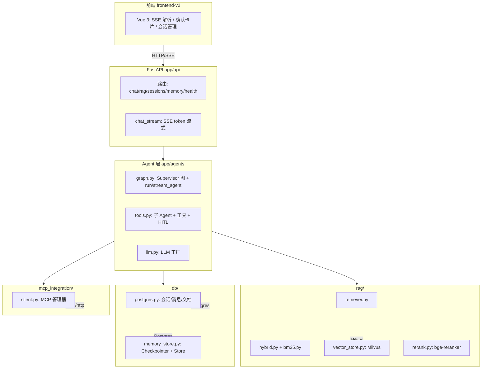
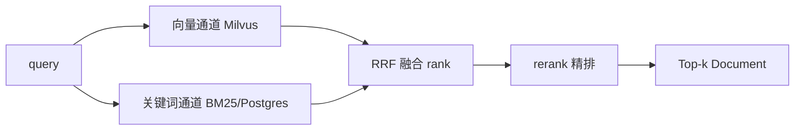

# 🔬 实现详解（DEEP DIVE）

> 相关文档：[README](../README.md) · [架构文档地图](ARCHITECTURE.md) · [项目2·自主任务Agent](AGENT_TASK.md)

> 本文档面向**想读懂每一行代码怎么跑起来**的读者，按「配置 → LLM → Agent 编排 → 子 Agent → RAG → 记忆 → FastAPI → MCP → 前端 → Windows 兼容」逐层拆解真实实现。
> 与 `EXPLAIN.md`（整体理解，14 章）互补：这里更偏**函数级**调用链与设计取舍。
>
> 代码位置均为 `backend/app/` 下的真实路径，函数名/类名可直接对照源码。

## 目录

1. [分层架构总览](#1-分层架构总览)
2. [配置中心 `config.py`](#2-配置中心-configpy)
3. [LLM 工厂 `llm.py`](#3-llm-工厂-llmpy)
4. [Agent 编排 `graph.py`](#4-agent-编排-graphpy)
5. [子 Agent 与工具 `tools.py`](#5-子-agent-与工具-toolspy)
6. [RAG 实现链路 `rag/`](#6-rag-实现链路-rag)
7. [记忆实现 `db/memory_store.py`](#7-记忆实现-dbmemory_storepy)
8. [FastAPI 部分 `api/` + `main.py`](#8-fastapi-部分-apimainpy)
9. [MCP 集成 `mcp_integration/`](#9-mcp-集成-mcp_integration)
10. [前端与 SSE 交互](#10-前端与-sse-交互)
11. [Windows 兼容（事件循环）](#11-windows-兼容事件循环)
12. [关键设计决策与坑](#12-关键设计决策与坑)
13. [容错机制（超时 / 缓存 / 重试）](#13-容错机制超时--缓存--重试)

---

## 1. 分层架构总览



- **请求入口**：FastAPI 路由 → `chat.py` 调 `graph.py` 的 `run_agent` / `stream_agent`。
- **Agent 编排**：`create_agent`（LangGraph 官方高层 API）构建 Supervisor 图；子 Agent 被 `agent_to_tool` 包装成**工具**（层级模式）。
- **记忆**：短期 = Checkpointer（Postgres），长期 = Store（Postgres），运行时上下文 = `UserContext`。
- **RAG**：文档摄入 → Milvus 向量 + Postgres BM25 → RRF 融合 → rerank 精排。
- **MCP**：自建 stdio（db/time）+ 外部 streamable http，统一转成 LangChain 工具。

---

## 2. 配置中心 `config.py`

`app/config.py` 用 **pydantic-settings** 从环境变量 / `backend/.env` 加载，`extra="ignore"` 容忍多余变量。

核心属性（属性 = 环境变量同名，如 `AGENT_TIMEOUT` → `agent_timeout`）：

| 分组 | 关键项 | 默认 | 说明 |
|------|--------|------|------|
| 应用 | `log_level` / `agent_timeout` | INFO / 120 | 日志级别、单轮超时 |
| Postgres | `postgres_*` | localhost / 5432 / agentchat | 提供 `postgres_dsn`（SQLAlchemy）与 `postgres_conninfo`（psycopg 原生）两个派生串 |
| Milvus | `milvus_host/port/uri` | localhost / 19530 / "" | `milvus_connection_uri` 属性自动拼 `http://host:port` |
| LLM | `llm_provider`（默认 `deepseek`）/ `llm_timeout=60` / `llm_max_retries=2` / `llm_light_model` | — | 多 provider 切换（`llm_model` 仅 ollama 用）；配置 `llm_light_model` 后子 Agent 用轻量模型 |
| Agent 工具 | `code_agent_enabled` / `code_exec_timeout` / `tavily_api_key` / `tavily_max_results` | true / 15 / - / 5 | 代码沙箱与联网搜索 |
| 检索 | `hybrid_search` / `bm25_*` / `rrf_k` / `rerank_*` | true / 60 / 4 | 混合检索 + rerank |
| 上传 | `upload_dir` / `max_upload_mb` | data/uploads / 50 | 原始文件持久化 + 大小上限（413） |
| 记忆 | `memory_semantic_search` / `memory_dedup_threshold` | true / 0.86 | Store 语义索引与去重阈值 |
| HITL | `hitl_enabled` / `hitl_actions` | true / [] | 人工确认开关（默认 LLM 自主判定；非空=强制确认+开关豁免） |
| 容错 | `agent_cache_enabled` / `subagent_retries` / `hf_offline` | true / 1 / true | LLM 提示缓存、子 Agent 重试、模型离线加载 |
| CORS | `cors_origins` | localhost:8000 白名单 | 避免 `"*"+credentials` 回显任意 Origin |

关键派生属性：

```python
@property
def postgres_dsn(self):      # SQLAlchemy: postgresql+psycopg://...
    return f"postgresql+psycopg://{user}:{pwd}@{host}:{port}/{db}"

@property
def postgres_conninfo(self): # psycopg 原生（去掉 +psycopg）
    return self.postgres_dsn.replace("+psycopg", "")

@property
def milvus_connection_uri(self):
    return self.milvus_uri or f"http://{host}:{port}"
```

`postgres_conninfo` 专门喂给 `langgraph-checkpoint-postgres`（AsyncPostgresSaver/AsyncPostgresStore），因为那个库用的是 psycopg 异步连接串而非 SQLAlchemy。

---

## 3. LLM 工厂 `llm.py`

`app/agents/llm.py` 的 `get_llm()` 是 **`@lru_cache` 单例**，按 `settings.llm_provider` 分支创建：

| provider | 类 | 说明 |
|----------|-----|------|
| `deepseek` | `ChatOpenAI` + deepseek 配置 | 默认（OpenAI 兼容） |
| `dashscope` | `ChatOpenAI` + dashscope 配置 | 阿里通义 |
| `openai` | `ChatOpenAI` | 任意 OpenAI 兼容端点 |
| `azure_openai` | `AzureChatOpenAI` | Azure 部署名 |
| `ollama` | `ChatOllama` | 本地，无超时/重试 |

所有 OpenAI 兼容系统一注入 `_openai_kwargs()`：`timeout=60` + `max_retries=2`，网络抖动自动重试、防挂起。**lru_cache 保证全项目共享同一个 LLM 实例**（避免每次请求重建连接）。

**轻量模型与运行时切换**：`get_llm(kind="main"|"light")` 支持 `LLM_LIGHT_MODEL`——配置后 Supervisor 用主模型、子 Agent 用轻量模型（`_model_name("light")`）。`available_models()` / `set_current_model()` 支撑前端 `/api/models` 运行时切换：选择持久化到 `data/model_choice.json`，并清空 LLM/图缓存，立即生效（重启后仍保留）。

---

## 4. Agent 编排 `graph.py`

`app/agents/graph.py` 是核心：构建 Supervisor 图 + 提供两个运行入口。顶层 `from langchain.agents import create_agent`（官方高层 API，内部即 `add_node`/`add_edge`/`compile` 的封装，见 EXPLAIN 第 11 章）。

### 4.1 图构建 `get_supervisor_graph(use_rag, use_search, use_memory)`

- **按配置指纹缓存**：`key = (use_rag, use_search, use_memory, checkpointer就绪, store就绪)`，同一开关组合只构建一次。
- 按开关动态组装工具列表：
  - `use_rag` → `rag_agent` 包装成工具（`confirm_before=_needs_confirm("rag")`）
  - 恒有 → `mcp_agent`（`confirm_before=_needs_confirm("mcp")`）
  - `use_search` → `web_search`（**直接 Tavily 工具**，非子 Agent；若 Tavily key 存在；`confirm_before=_needs_confirm("search")`）
  - `code_agent_enabled` → `code_agent`（受限沙箱执行 Python）
  - `use_memory` → `remember_memory` / `recall_memory`（长期记忆；关闭时不注册）
  - HITL 且 `hitl_actions` 为空 → `request_confirmation`（软性确认工具）
- `create_agent(get_llm(), tools, system_prompt, checkpointer, store, context_schema=UserContext)`。
- 配置指纹里含 checkpointer/store 就绪状态，**避免状态变化后继续用过期图**。

### 4.2 动态提示词 `_build_supervisor_prompt(use_rag, use_search, use_memory)`

> **关键修复**：曾经是静态 `SUPERVISOR_PROMPT`，关闭知识库时 LLM 仍幻觉调用不存在的 `rag_agent`。现在按开关**同步增删工具描述 + 规则**，并显式禁止调用已关闭的 Agent。

- `tool_lines`：仅列出已注册的工具描述（`use_rag` 关则无 `rag_agent` 行；HITL 且 `hitl_actions` 为空时才有 `request_confirmation` 行）。
- `rules`：编号从 1 到 n+5 动态拼接，含"知识库已关闭禁止调用 rag_agent"、记忆工具强制调用、HITL 确认规则等。

### 4.3 `run_agent()`（非流式）

```python
# 有 Checkpointer：只传当前消息，历史由 thread_id 自动恢复
messages = [("user", question)]
result = await graph.ainvoke(
    {"messages": messages},
    config={"configurable": {"thread_id": session_id}},
    context=UserContext(user_id=...),
)
```

- 外层 `asyncio.timeout(settings.agent_timeout)` 兜底，超时抛 `AgentTimeoutError` → 路由返回 504。
- `resume` 非空时改走 `graph.ainvoke(Command(resume=resume), ...)`（HITL 断点恢复）。
- `checkpoint_id` 非空时（Time Travel）config 里带上 `"checkpoint_id"`，LangGraph 据此从该历史点**分叉新分支**继续（见 4.6）。
- 检测 `result.get("__interrupt__")` → `hitl_pending`（HITL）。
- 经 `last_ai_text()` 逆序取最后一条 AI 消息作为答案（复用 `extract_text`，兼容 content blocks）。
- 通过 `on_event` 回调发出 `start` / `agent` / `tool` / `interrupt` / `end` / `error` 事件。

### 4.4 `stream_agent()`（token 级流式，SSE 用）

```python
async for mode, data in graph.astream(
    astream_input,            # Command(resume) 或 {"messages": messages}
    config=config,
    context=UserContext(...),
    stream_mode=["updates", "messages"],
):
    if mode == "updates":
        # 识别 __interrupt__ 节点（HITL）与 tool 调用消息
    elif mode == "messages":
        # 只收顶层 supervisor 的 AI token
        if "|" in (meta.get("langgraph_checkpoint_ns") or ""):
            continue          # 子 Agent 嵌套命名空间，跳过
        if isinstance(chunk, AIMessageChunk):
            await on_token(text)
```

**关键点**：`checkpoint_ns` 用 `"|"` 分隔嵌套任务——顶层形如 `model:<task_id>`，子 Agent 形如 `model:<id>|mcp_agent:<id>`。**只有不含 `|` 的才是 supervisor 的输出**，避免子 Agent 中间文本污染答案流。

**开场白缓冲 + 去重**：工具调用前的 token 先缓冲（`pre_tool_text`），检测到 `tool_call_chunks` 时经 `_emit_tool` **一次性推送完整开场白**（工具执行前显示并点亮轨道光晕）；工具后的答案流经 `_PreludeDedupe` **前缀去重**（LLM 常把开场白连同答案一起重新生成）。统一超时经 `_agent_timeout_scope` 上下文管理器。

### 4.5 多轮历史（Checkpointer 自动恢复）

不再手动拼接/裁剪历史：每次请求只传当前消息 `[("user", question)]`，历史由 Checkpointer 按 `thread_id` 自动恢复（`resume` / `checkpoint_id` 场景同理，由断点/历史点恢复）。长对话建议新建会话归档。

### 4.6 Time Travel（版本历史 / 分叉）

**机制**：Checkpointer 每执行一步保存一个 checkpoint，`parent_checkpoint_id` 串成**版本链**（`checkpoints` 表）。LangGraph 的 `config` 里带上 `"checkpoint_id"` 时，`ainvoke/astream` 会从该历史 checkpoint 的状态**继续执行**——即在该点**分叉一条新分支**（不覆盖原历史）。

- **`_prepare_run(..., checkpoint_id)`**：`config = {"configurable": {"thread_id": sid, "checkpoint_id": cid}}`；有 checkpoint_id 时历史由该 checkpoint 恢复，与正常多轮一致只传当前消息。
- **`list_checkpoint_history(session_id, limit=30)`**：`graph.aget_state_history({...thread_id})` 遍历 `StateSnapshot`，返回 `checkpoint_id / parent_checkpoint_id / created_at / next / summary(最后一条AI消息) / interrupted(是否处于HITL待确认)`，供前端时间线渲染。
- **API**：`GET /api/sessions/{id}/checkpoints` 返回历史；`/api/chat(/stream)` 请求体 `checkpoint_id` 触发分叉。
- **约束**：`resume` 与 `checkpoint_id` 互斥（同时传 → 400）；分叉时跳过 `_check_pending_interrupt`（新分支与当前 pending 无关）。
- **前端**：会话头部「⏪ 版本历史」按钮 → modal 时间线（#1 最新），每条可「🔄 从这步重跑」→ 输入新消息 → `sendMessage({text, checkpoint_id})` 程序化发送。
- **验证**：两轮对话 → 8 个 checkpoint；从历史点 fork → checkpoint 8→11（新分支）；resume+checkpoint_id → 400。

---

## 5. 子 Agent 与工具 `tools.py`

`app/agents/tools.py` 定义所有子 Agent 与工具（`app/agents/nodes/` 目录为空，子 Agent 不走手写节点）。

### 5.1 子 Agent 与直接工具

| 构建函数 | 类型 | 工具 | 说明 |
|----------|------|------|------|
| `build_rag_agent()` | 子 Agent（`create_agent` 独立小图） | `create_retriever_tool(retriever, "search_knowledge_base", ...)` | 仅基于检索内容回答、不编造、必须调用检索工具 |
| `build_mcp_agent()` | 子 Agent（`create_agent` 独立小图） | `get_mcp_manager().get_langchain_tools()`（全部已连 MCP 工具） | 数据库只读 SELECT/WITH、整理清晰答案 |
| `build_search_tool()` | **直接工具**（`StructuredTool`） | `langchain_tavily.TavilySearch`，兜底 `langchain_community.tavily_search` | 单次 Tavily 调用即返回结果，Supervisor 自行总结 |
| `build_code_agent()` | 子 Agent（受限沙箱） | `execute_python_code` 工具 | 子进程隔离 + 超时 kill + 危险能力禁用 + 模块白名单 + 输出截断 |

> **搜索为何是直接工具而非子 Agent**：子 Agent 方案实测一次搜索会触发
> 4 次 Tavily + 3 次 LLM（ReAct 反复搜索），耗时 ~23s；改为直接工具后单次
> 调用 ~3s，Supervisor 直接基于结果总结。`build_search_tool` 无
> `TAVILY_API_KEY` 时返回 `None`，supervisor 工具列表相应跳过。

### 5.2 `agent_to_tool()`：层级模式（子 Agent 作工具）

```python
async def _arun(query: str) -> str:
    if confirm_before:                       # HITL 强制确认
        choice = interrupt({...})
        if choice != "confirmed":
            return f"操作已取消：用户未确认调用 {name}。"
    result = await agent.ainvoke({"messages": [("user", query)]})
    # 逆序找最后一条 ai 消息返回
```

- 把子 Agent 的**整个小图**包装成 `StructuredTool`（name=rag_agent 等），供 Supervisor 当作一个工具调用。
- 这就是"Supervisor → 子 Agent"层级模式的落地：Supervisor 决策调哪个工具，子 Agent 内部自成一个 ReAct 循环。

### 5.3 长期记忆工具（Supervisor 直接使用）

- `build_remember_tool()`（`remember_memory`）：经 `get_runtime()` 取 `rt.store`，namespace=`(user_id, "memories")`；写入前 `asearch` 语义去重，相似度 ≥ `memory_dedup_threshold`（0.86）则**更新该条**而非新增。
- `build_recall_tool()`（`recall_memory`）：`asearch(namespace, limit=50)` 列出该用户全部记忆；无索引时降级返回全部。

> 工具经 `get_runtime()`（`langgraph.runtime`）访问 Store 与上下文——官方公开 API，避免依赖注入样板。

### 5.4 HITL 确认工具

- `build_confirmation_tool()` → `request_confirmation`：`_arun` 内直接 `interrupt({...})` 暂停图，返回"用户确认结果: {choice}"。
- **设计取舍**：`hitl_actions` 非空时**不注册**此工具（避免 supervisor 先主动 request_confirmation、再触发 confirm_before 的**双重确认**）；仅 `hitl_actions` 为空时注册作为软性兜底。

---

## 6. RAG 实现链路 `rag/`

### 6.1 摄入 `ingestion.py`

- `split_text`：**Markdown 按标题分块**（`#`/`##`/`###`）+ 长度递归切分，`chunk_size=800` / `chunk_overlap=100`。
- `ingest_file`：解析（txt/md/pdf/docx/html）→ 分块 → embedding → 写 Milvus → 写 Postgres `documents` 元数据（**原子**：失败清理已写入块）。
- 原始文件持久化到 `data/uploads/<uuid>/`（`rag.py` 里 `_safe_source_in_uploads` 用 `is_relative_to` 防目录穿越）。

### 6.2 向量存储 `vector_store.py`

- `MilvusClient` 单例（pymilvus 3.0 新 API）。
- `_ensure_indexes`：embedding 向量建 **IVF_FLAT** 索引 + source / user_id 字段建 **Trie** 索引（支持按来源与用户过滤）。
- `_validate_embedding_dim`：与 `embedding_dim`（512）校验，防止模型切换后维度不匹配。
- 提供 `search` / `add_chunks` / `delete_by_source` / `delete_by_ids` / `stats`；`user_filter_expr` 统一生成按用户隔离的过滤表达式。

### 6.3 混合检索 `hybrid.py` + `bm25.py`



- **BM25 是纯 Python 实现**（`bm25.py`：中文按字切 + 英文单词，停用词过滤，Okapi 公式）——因为 pymilvus 3.0 没有 `BM25EmbeddingFunction`，所以用 **Python 侧 BM25 + Postgres 文本**做关键词通道。
- **缓存**：`_bm25_index` 按 `(count, max(created_at))` 签名 `lru_cache`——文档变化时签名变化自动失效。
- **防爆**：文档块数 > `bm25_max_docs`（5000）时跳过 BM25 通道，只走向量。
- `_rrf`：`1/(k+rank+1)` 累加多路排名，交集项获多路加分，`k=60`。

### 6.4 rerank `rerank.py`

- `CrossEncoder("BAAI/bge-reranker-base")`，`lru_cache` 单例，后台线程预热（`main.py` `_warmup_sync`）。
- 仅对 `rerank_candidate_k`（6）条候选精排，输入按 `rerank_max_length`（512）截断；失败自动降级（跳过精排）。

### 6.5 检索器 `retriever.py`

- `MilvusRetriever(BaseRetriever)`：`_get_relevant_documents` 走「混合检索 → 可选 rerank → 封装成带 score 的 `LCDocument`」，供 RAG 子 Agent 的 `create_retriever_tool` 直接用。

### 6.6 查询改写 `query_rewrite.py` 与注入防护 `prompt_injection.py`

- **查询改写**（默认关）：`rewrite_query()` 两档——`rule`（删口语框架词 + 同义词**并列扩展**，零依赖）/ `llm`（one-shot prompt 改写为精炼检索词，失败/拒绝模板回退）。`_expand_queries` 对「原 query + 改写」**双路检索**，按 `(source, chunk_index)` 合并去重；精排固定用**原 query**（实测短改写 query 精排不稳）。实验结论：当前知识库检索基线已饱和，改写无增益且端到端 faithfulness 微降，默认关闭；若启用走「触发式」（见 `docs/EVALUATION_REPORT.md` §4/§8）。
- **Prompt 注入防护**（`prompt_injection.py`）：检索/搜索外部内容经 `wrap_as_data` 包装为「不可信数据块」并声明忽略其中指令；`detect_injection` 中英规则库命中即**剔除该块 + 告警**，用户 query 命中 → 400 拒绝；可选 `INJECTION_LLM_REVIEW` 用 LLM 复核降误报（失败按命中处理）；输出侧 `detect_leak` 检测系统提示词片段/密钥模式（仅告警）。

---

## 7. 记忆实现 `db/memory_store.py`

### 7.1 三层记忆总览

| 层 | 机制 | 持久化 | 载体 |
|----|------|--------|------|
| 短期（会话内） | Checkpointer | 是（跨请求恢复图状态） | `AsyncPostgresSaver`，`thread_id=session_id` |
| 运行时上下文（当次调用） | `context_schema=UserContext` + `context=` | 否 | `UserContext(user_id)`，工具经 `get_runtime().context` 访问 |
| 长期（跨会话） | Store | 是（跨线程持久） | `AsyncPostgresStore`，namespace=`(user_id, "memories")` |

### 7.2 初始化（app 启动时）

```python
# init_checkpointer：psycopg 异步连接 + AsyncPostgresSaver + setup() 建表
_conn = await psycopg.AsyncConnection.connect(settings.postgres_conninfo, autocommit=True)
_checkpointer = AsyncPostgresSaver(_conn)
await _checkpointer.setup()
```

`init_store()` 分两步：
1. `memory_semantic_search` 开启时，尝试 `AsyncPostgresStore(_conn, index=IndexConfig(dims=512, embed=_embed))` —— **需要 pgvector 扩展**。
2. 失败（无 pgvector，如当前 `postgres:16` 容器）→ `logger.warning` 降级为**无索引 Store**（仅关键词/全文检索）。

> **现状提示**：docker-compose 已改为 `pgvector/pgvector:pg16` 镜像，但未重建容器，所以当前 Store 是关键词检索模式。重建后自动启用语义检索。

### 7.3 记忆工具与去重

- `remember_memory`：`asearch(namespace, query=content)` → 相似度 ≥ 0.86 则 `aput(相同key)` 覆盖更新，否则新建 `uuid` key。
- `recall_memory`：`asearch(namespace, limit=50)` 列出全部。

### 7.4 孤儿清理 `cleanup_stale_checkpoints`

启动时执行；删除会话（单删/批量）时定向清理对应 `thread_id`。**三表一起删**：`checkpoint_writes`（增量写入日志）、`checkpoints`（状态快照）、`checkpoint_blobs`（去重数据块）——`WHERE thread_id NOT IN (SELECT id FROM sessions)`（全量）或按 `thread_id`（定向），防止 Postgres 无限膨胀。

> **坑（已修）**：早期实现只删 `checkpoints/checkpoint_blobs`，**漏删 `checkpoint_writes`**，孤儿数据累积（曾达 616 行）。已补上三表删除。

### 7.5 HITL 与 Checkpointer 的关系

- `interrupt` 暂停时，**未完成的图状态（含 tool_calls）由 Checkpointer 持久化**；`Command(resume)` 从同一 `thread_id` 恢复。
- 因此 HITL 必须**依赖 Checkpointer**；`get_checkpointer()` 为 None（无状态模式）时 HITL 确认无法恢复。

---

## 8. FastAPI 部分 `api/` + `main.py`

### 8.1 应用入口 `main.py`

```python
@asynccontextmanager
async def lifespan(app):
    init_db()                       # 建表 + 幂等建索引
    ensure_vector_store()           # Milvus（失败不阻塞）
    await init_checkpointer()       # 短期记忆
    await init_store()              # 长期记忆
    cleanup_stale_checkpoints()     # 孤儿清理
    await get_mcp_manager().start_all()   # MCP 服务器
    threading.Thread(target=_warmup_sync).start()  # rerank/embedding 模型 + BM25 索引 + Supervisor 图预热
    yield
    await get_mcp_manager().stop_all()
    await close_checkpointer(); await close_store()
```

- 挂载路由：`/api/health` `/api/sessions` `/api/memory` `/api/rag` `/api/chat` `/api/auth` `/api/tasks` `/api/models`。
- 后台 `scheduler_loop`（asyncio 任务）按 `interval:<秒>` / `cron:<分钟>` 周期执行注册的批处理任务。
- `app.mount("/", StaticFiles(directory=APP_DIST, html=True))` 托管 `frontend-v2/dist` 构建产物（Vue 3 前端）。
- CORS 显式白名单。

### 8.2 路由总览

| 路由文件 | 前缀 | 端点 | 说明 |
|----------|------|------|------|
| `health.py` | `/api` | `GET /health` | Postgres / Milvus / MCP 健康状态 |
| `sessions.py` | `/api/sessions` | `GET/POST`、`GET/PATCH/DELETE /{id}`、`POST /batch-delete`、`GET /{id}/stats`、`GET /{id}/export`、`GET /{id}/checkpoints` | 会话 CRUD + 历史 + 批量删除（同步清 checkpoint）+ 数据分析 + 导出 Markdown + **版本历史（Time Travel）** |
| `memory.py` | `/api/memory` | `GET/POST`、`DELETE /{id}`、`DELETE ""` | 长期记忆管理（操作 Store） |
| `rag.py` | `/api/rag` | 上传（≤`MAX_UPLOAD_MB`）/ 文档列表 / 预览 / 删除 / 检索测试 | 文档管理（上传 413 限流、删除失效 BM25 签名） |
| `chat.py` | `/api/chat` | `POST ""` 非流式、`POST /stream` SSE | 对话 |
| `auth.py` | `/api/auth` | `register` / `login` / `me` / `stats` | 用户注册 / 登录 / 当前用户 / 统计 |
| `tasks.py` | `/api/tasks` | `GET/POST`、`PATCH/DELETE /{id}`、`GET /registry`、`POST /{id}/run` | 定时任务管理 + 手动触发 |
| `models.py` | `/api/models` | `GET ""`、`PUT /current` | 可用模型列表 + 运行时切换 |

### 8.3 chat 路由（核心）

**关键设计：同步 DB 放线程池，不阻塞事件循环** —— SQLAlchemy 保持同步，用 `anyio.to_thread.run_sync` 包裹 DB 调用。

- `_prepare_session(session_id)`：有 id 校验存在（404），无 id 则 `create_session()` 新建（同时是 `thread_id`）。
- `_prepare_context(req)`：会话准备 + HITL 防护 + 保存用户消息（resume 时跳过）；历史不再手动组装（由 Checkpointer 从 `thread_id` 恢复）。
- `_check_pending_interrupt`（HITL 防护）：复用会话发普通新消息时，`graph.aget_state` 查 `tasks[].interrupts`，有则 **409 明确提示**（避免把未完成 tool_calls 历史发给 LLM 触发 400）。带 **5s TTL 短路缓存**（`_hitl_checked`）避免每个请求都恢复图状态；产生 pending interrupt 时主动清缓存，确保用户后续请求重新检查。**Time Travel 分叉（`checkpoint_id`）时跳过该检查**——新分支与当前 pending 无关。
- **Time Travel**：`ChatRequest.checkpoint_id` 透传给 `run_agent/stream_agent` → `_prepare_run` 在 config 里加 `checkpoint_id` 分叉（详见 4.6）；`resume` 与 `checkpoint_id` 互斥（同时传 → 400）。
- **SSE 流式 `chat_stream`**：

```python
async def produce():
    result = await stream_agent(..., resume=req.resume, checkpoint_id=req.checkpoint_id,
                                on_event=on_event, on_token=on_token)
    if result.get("hitl_pending") is not None:
        return                    # HITL：不发 message 帧，等用户 resume
    postgres.add_message(session_id, "assistant", result["answer"])
    await queue.put({"type": "message", ...})
```

  - `on_event`/`on_token` 把事件与 token 推进 `asyncio.Queue`；`event_stream` 边读边 `yield _sse_frame(...)`（`data: json\n\n`）。
  - 结束哨兵 `None`；异常也推 `error` 帧并 `finally` 发哨兵。
  - `interrupt` 事件由 `on_event` 补 `session_id`，供前端 resume 复用同一 `thread_id`。
  - 响应头 `Cache-Control: no-cache`、`X-Accel-Buffering: no`（防代理缓冲）。

- 非流式 `chat`：收集全部事件 → `ChatResponse(session_id, answer, events, used_agents, hitl_pending)`。

### 8.4 schemas（`schemas/chat.py`）

- `ChatRequest`：`session_id?` / `user_id?` / `message` / `use_rag` / `use_search` / `use_memory` / `resume?`（HITL）/ `checkpoint_id?`（Time Travel 分叉起点）。
- `AgentEvent`：`type` 为 Literal 含 `interrupt`，`content` + `data`。
- `ChatResponse`：`answer` / `events` / `used_agents` / `hitl_pending?`。

### 8.5 数据模型 `db/models.py`

- `Session`（id 32 位 hex / title / created_at / updated_at **索引**）。
- `Message`（session_id 外键 CASCADE / role / content）。
- `Document`（`user_id`+source+chunk_index 唯一约束 / metadata_json / text，向量在 Milvus，id 一致；知识库按用户隔离）。

### 8.6 会话刷新排序（坑与修复）

`add_message` 里**显式** `s.updated_at = utcnow()`——`onupdate` 只在 UPDATE 语句触发，若不改标题，`updated_at` 不刷新导致活跃会话排后面。同时首条用户消息前 20 字设为会话标题。

---

## 9. MCP 集成 `mcp_integration/`

### 9.1 客户端管理器 `client.py`

`McpClientManager` 统一管理两类连接：

- **自建 stdio**（`db` / `time`）：`StdioServerParameters` + `stdio_client` + `ClientSession`，cwd=项目根。
- **外部 http**（`EXTERNAL_MCP_SERVERS`，逗号分隔 `name=url`）：`streamable_http_client`（mcp ≥1.9 提供，直接使用）。

生命周期用 `AsyncExitStack` 统一管理，`start_all`/`stop_all` 幂等；单服务器失败只告警不影响整体。

### 9.2 工具转换链路

```python
def get_langchain_tools(self):
    for server, handle in self._handles.items():
        for tool in handle.tools:
            tools.append(self._to_langchain_tool(server, tool, handle.session))
```

- `_to_langchain_tool`：MCP 工具 → `StructuredTool`，**名称加服务器前缀**（防跨服务器重名），`coroutine` 内调 `session.call_tool(...)` 并把结果解析为文本。

### 9.3 自建服务器（`scripts/`）

- `db_query_server.py`：**只读 SQL**（白名单校验 `SELECT`/`WITH`，拒绝写操作/多语句）。
- `time_server.py`：时间/日期计算工具。

---

## 10. 前端与 SSE 交互（frontend-v2，Vue 3）

前端为 `frontend-v2/`（**Vue 3 + Vite + TypeScript + Tailwind CSS 4 + Pinia**）：
开发时 Vite dev server（`:5173`，`/api` 代理到 `:8000`）；生产 `npm run build` 后
`dist/` 由 FastAPI 托管。

### 10.1 目录结构

```
frontend-v2/src/
├── api/            # HTTP 层
│   ├── client.ts   # 统一 fetch（Bearer + JSON + 错误解析 ApiError）
│   ├── token.ts    # localStorage token/user（隔离 store 循环依赖）
│   └── index.ts    # health / auth / sessions / docs / memory / tasks + streamChat(SSE)
├── stores/         # Pinia：chat / sessions / auth / docs / memory / tasks / theme
├── utils/
│   ├── sse.ts      # readSSEStream：按 \n\n 分帧解析 data: JSON → onEvent
│   └── markdown.ts # marked 单例 + markedHighlight(hljs 按需注册) + DOMPurify 消毒
├── types/api.ts    # 后端 API 类型定义
└── components/     # common(Icon/Modal/Switch/Dropdown/EmptyState) + sidebar + chat + dialogs
```

### 10.2 SSE 流式链路

- `api/index.ts::streamChat(payload, onEvent, signal)`：`fetch POST /api/chat/stream`
  + `utils/sse.ts::readSSEStream` 逐帧解析 `data: {...}` → 回调 `onEvent`。
- `stores/chat.ts::send()`：push 用户消息 + 空的 assistant 消息（用 `reactive()` 包装，
  保证流式期间通过闭包修改该对象能触发 Vue 渲染）→ `_runStream`（AbortController 支持停止）。
- `_handleEvent` 分发：
  - `token` → 追加到 assistant 消息 `content`（组件 `useThrottleFn(60ms)` + `md.renderStream` 渲染）
  - `message` → 最终一致快照 + 更新 `session_id` / 会话标题
  - `interrupt` → 记 `hitlMsgId`，气泡内渲染确认卡片
  - `start/tool/end/error` → 推入 `orbit` 轨道节点（OrbitFlow 渲染）
- **渲染**：`MessageItem.vue` 对 `msg.content` 用 marked 渲染（`marked-highlight` 代码高亮 +
  DOMPurify 消毒）；流式中未闭合的 ``` 由 `md.renderStream` 转义为文本，避免吞掉后续内容。

### 10.3 HITL 确认

`interrupt` 事件到达后，该 assistant 消息的 `hitl` 字段被设置，气泡内出现「确认/取消」卡片；
点击后 `stores/chat.ts::resume(choice, sessionId)` 复用**同一消息**（`hitlMsgId`），以
`resume=confirmed|cancelled` 重发 `/api/chat/stream`，轨道在同一气泡内继续（不新建气泡）。

### 10.4 Orbit 编排轨道

`start/tool/end/error` 事件渲染为 `OrbitFlow` 节点（Supervisor → mcp_agent → 完成），
青色脉冲点仅在**该消息仍流式生成**且为当前最后一个工具节点时动画，回答完成即静止。

### 10.5 主题与测试

- `stores/theme.ts`：通过 `html.light` 类覆盖全部 Tailwind CSS 变量实现暗/亮主题切换（localStorage 持久化）。
- Vitest 单元测试：`src/**/*.{test,spec}.ts`（SSE 解析 / markdown 渲染+未闭合围栏 / chat store：token 累积、HITL 同气泡、停止、reactive 回归）。

---

## 11. Windows 兼容（事件循环）

`psycopg` 异步模式（`AsyncPostgresSaver`/`AsyncPostgresStore`）在 Windows **默认 ProactorEventLoop 下不可用**，必须用 SelectorEventLoop。三重保障：

1. `main.py` 顶部：`asyncio.set_event_loop_policy(WindowsSelectorEventLoopPolicy())`。
2. `run.py`：启动 uvicorn 前同样设置，并传 `loop="app.event_loop:selector_loop_factory"`。
3. `app/event_loop.py`：`selector_loop_factory` 返回 `SelectorEventLoop`（非 Windows 用默认）。

> 结论：**Windows 上务必用 `python run.py` 启动**，否则 Checkpointer/Store 初始化失败、图降级为无状态（记忆/HITL 失效）。

---

## 12. 关键设计决策与坑

| # | 决策/坑 | 方案 |
|---|---------|------|
| 1 | 静态 supervisor prompt 导致关闭 RAG 后幻觉调用 rag_agent | `_build_supervisor_prompt(use_rag, use_search, use_memory)` 动态生成，工具描述与规则同步开关 |
| 2 | 不改 ORM 为异步 | SQLAlchemy 保持同步 + `anyio.to_thread.run_sync` 线程池（热点路由不卡事件循环） |
| 3 | Windows psycopg 异步事件循环不兼容 | 三层 SelectorEventLoop 保障，统一 `run.py` 启动 |
| 4 | 会话活跃排序失效（onupdate 不触发） | `add_message` 显式 `s.updated_at = utcnow()` |
| 5 | pymilvus 3.0 无 BM25EmbeddingFunction | Python 侧 BM25 + Postgres 文本 + RRF 混合 |
| 6 | pgvector 缺失导致 Store 无语义索引 | `init_store` 自动降级关键词检索（日志告警），镜像就绪即自动启用 |
| 7 | HITL 双重确认（主动 request_confirmation + confirm_before 叠加） | `hitl_actions` 非空时不注册 `request_confirmation`，只保留强制确认 |
| 8 | 中断会话续发新消息触发 LLM 400 | `_check_pending_interrupt` 返回 409 明确提示 |
| 9 | mcp 2.x 改名 streamable_http_client | 直接使用 mcp ≥1.9 的 streamable_http_client（requirements 下限 1.9） |
| 10 | rerank 首个请求下载慢卡顿 | 后台线程预热 + 候选数/长度截断 |
| 11 | Milvus embedding 维度漂移 | `_validate_embedding_dim` 启动校验 |
| 12 | 删除会话后 checkpoint 膨胀 | `cleanup_stale_checkpoints` 启动清理孤儿 |
| 13 | LLM 网络抖动挂起/偶发失败 | 统一 `timeout=60` + `max_retries=2` |
| 14 | 子 Agent 中间文本污染答案流 | `checkpoint_ns` 含 `|` 的命名空间跳过 |

---

## 13. 容错机制（超时 / 缓存 / 重试）

> LangGraph 1.2.10 节点级容错（`add_node(retry_policy/timeout/cache_policy/error_handler)`）仅对手写 `StateGraph` 开放；本项目用高层 `create_agent`，因此采用以下三套等效容错（见 12 章第 1 条约束）。

### 13.1 模型调用中间件 `agents/middleware.py`

`ModelResilienceMiddleware(AgentMiddleware)` 通过 `awrap_model_call` 责任链在**每次模型调用**前统一注入：

- **超时**：`asyncio.wait_for(handler(request), timeout=llm_timeout)`，单次模型调用卡死即中断。
- **日志**：记录每次调用耗时、超时/失败，便于观测。
- **不重试**：重试职责分层——LLM 客户端管网络层重试（`LLM_MAX_RETRIES`），`agent_to_tool` 管子 Agent 整体重试（`SUBAGENT_RETRIES`）。三层都重试会指数放大失败请求数，故本层只做超时 + 日志。

```python
graph = create_agent(
    get_llm(), tools=tools, system_prompt=...,
    middleware=[resilience_middleware()],   # supervisor 与各子 Agent（rag/mcp/code）共用单例
)
```

> `awrap_model_call` 是**内联组合**（不生成独立图节点），所以 `graph.nodes` 仍是 `['__start__','model','tools']`。`name` 是 property（不能类属性赋值）。

### 13.2 图执行 / LLM 提示缓存

`create_agent(..., cache=InMemoryCache())` → `graph.compile(cache=...)`，对**相同输入**（prompt + model）命中并跳过重复 LLM 调用：

- 单例：`graph.py` `_get_agent_cache()`（受 `AGENT_CACHE_ENABLED` 控制）。
- **命中条件苛刻**：对话历史每次变化 → prompt 不同 → 不命中；只有完全相同的重复提问才命中。
- **已知风险**：工具类问题（搜索/RAG）在数据变化后若被缓存，会返回旧答案——命中率低，风险可控，可关 `AGENT_CACHE_ENABLED=false`。
- HITL 安全：`Command(resume)` 输入不同，不命中缓存。

### 13.3 子 Agent 调用重试 `tools.py`

`agent_to_tool._arun` 内对 `agent.ainvoke` 按 `subagent_retries`（默认 1）指数退避重试；多次失败返回友好错误串（"子 Agent X 调用失败（已重试 N 次）…"），不向上抛异常中断整轮。

### 13.4 容错全景

| 层 | 机制 | 配置 |
|----|------|------|
| 请求级 | `asyncio.timeout(agent_timeout=120)` 包 run/stream_agent | `AGENT_TIMEOUT` |
| 模型调用 | middleware 超时（`LLM_TIMEOUT`）+ 日志（不重试） | `app/agents/middleware.py` |
| LLM 客户端 | OpenAI 兼容 `timeout=60` + `max_retries=2`（网络层重试） | `LLM_TIMEOUT` / `LLM_MAX_RETRIES` |
| 图执行缓存 | `InMemoryCache` 相同输入命中 | `AGENT_CACHE_ENABLED` |
| 子 Agent | `agent_to_tool` 重试 | `SUBAGENT_RETRIES` |
| 模型加载 | 离线加载（`HF_HUB_OFFLINE=1`，避免 HF 不可达时联网 HEAD 重试卡住） | `HF_OFFLINE` |
| 工具降级 | 记忆/rerank/混合检索/Store 各 try/except 降级 | 代码内 |
| SSE 兜底 | `chat.py` produce `except Exception` → error 帧 | 代码内 |

---

## 附录：文件 → 章节速查

| 文件 | 章节 |
|------|------|
| `app/config.py` | 2 |
| `app/agents/llm.py` | 3 |
| `app/agents/graph.py` | 4 |
| `app/agents/tools.py` | 5 |
| `app/rag/`（ingestion/vector_store/hybrid/bm25/rerank/retriever/embedding） | 6 |
| `app/db/memory_store.py` | 7 |
| `app/db/postgres.py` / `models.py` | 8 |
| `app/api/routes/` + `schemas/` | 8 |
| `app/main.py` | 8 |
| `app/mcp_integration/client.py` + `scripts/*_server.py` | 9 |
| `frontend-v2/src/api` + `utils/sse.ts` + `stores/chat.ts` + `components/chat/*` | 10 |
| `app/event_loop.py` + `run.py` | 11 |
