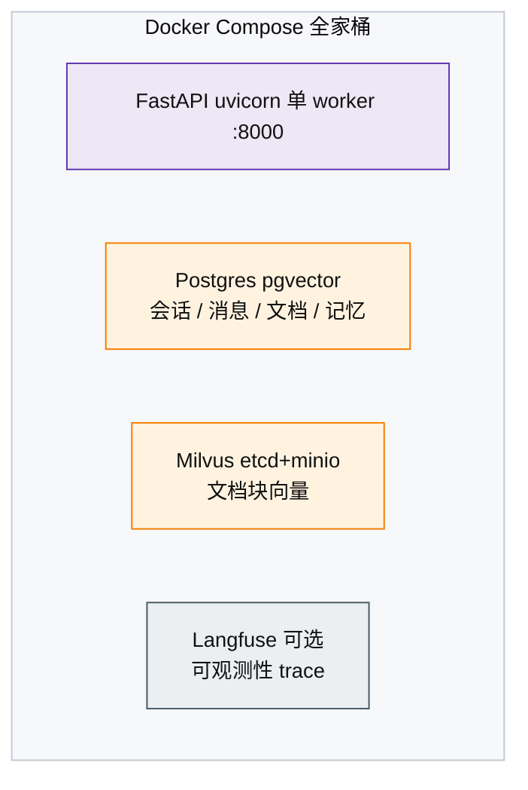

# 部署与扩展性指南

> 相关文档：见 [文档地图](README.md)；项目 2 见 [AGENT_TASK](AGENT_TASK.md)。
> 最后校验：2026-08-29（文档与当前代码同步；防漂移检查见 `backend/scripts/check_docs_stale.py`）

> 目的：说明本项目当前的**单机部署模型**、为什么这么选（取舍）、以及在何时、如何演进到
> 多 worker / 多副本。这是架构决策记录，供运维排障与扩展参考。

---

## 1. 当前部署模型（单机单 worker）



- **单进程**：`run.py` 启动一个 uvicorn worker；
- **定位**：个人 / 小团队，知识库块数 < 5000，QPS 低；
- **优点**：零外部依赖（除 Postgres/Milvus）、部署简单、进程内缓存一致性好。

## 2. 单机取舍的根因：进程内状态清单

多 worker 之所以不能直接开，是因为项目里有**一批进程内状态/缓存**——开多 worker 后各自独立，
会造成数据不一致。这是"先单机"的架构依据。

| 状态 | 位置 | 多 worker 后果 | 影响 |
|------|------|---------------|------|
| `_graph_cache`（supervisor 图） | `app/agents/graph.py` | 每 worker 各构建一次 | 仅耗时，可接受 |
| `_bm25_index` / `_signature_cache` | `app/rag/hybrid.py` | 每 worker 各一份内存索引 | 内存翻倍 |
| `_INGEST_TASKS`（摄入任务表） | `app/api/routes/rag.py` | A worker 上传，B worker 查不到任务 | **功能错误** |
| `_RAG_SOURCES`（引用溯源） | `app/agents/tools/sources.py` | 溯源丢失 | 功能降级 |
| `_host_agent_cache`（任务 Agent 图） | `app/agents/task_agent_adapter.py` | 每 worker 各构建一次 | 仅耗时，可接受 |
| `lru_cache`（embedder/reranker） | `app/rag/*` | 每 worker 一份模型实例 | 内存翻倍（~2GB） |

> 关键认知：**当前架构 = "进程内缓存换零外部依赖"**。数据一致性靠"单进程持有全部状态"保证，
> 这是刻意取舍，不是缺陷。

## 3. 演进路径（分阶段）

### 阶段 1（现状）：单机
- **适用**：个人 / 小团队，`volumes/` 数据量可控，无并发上传压力。
- **取舍依据**：BM25 索引内存化带来检索零延迟；部署只依赖 2 个数据库。

### 阶段 2（多 worker）：共享缓存 + 落库
> 当需要 uvicorn `--workers N` 时，先做这 3 步：

| 改动 | 做法 | 收益 |
|------|------|------|
| `_INGEST_TASKS` 落库 | 摄入任务写入 Postgres（复用 `tasks` 表思路） | 任意 worker 可查任务进度 |
| `_RAG_SOURCES` 持久化 | 直接依赖已持久化的 `Message.sources`（检索工具写入） | 溯源不丢 |
| `_signature_cache` / BM25 | 签名缓存放 Redis；BM25 接受每 worker 重建（块 <5000 成本低） | 一致性与内存可控 |
| `_graph_cache` | 保留每 worker 重建（图构建 ~秒级，预热即可） | 无需改 |

### 阶段 3（多副本 / 高可用）
> 当需要多台机器或滚动发布时：

| 改动 | 做法 |
|------|------|
| 会话亲和 | `thread_id`（session_id）路由到固定实例，或 Checkpointer 迁移到共享 Redis |
| 外部队列 | 摄入/任务改为 Redis 队列消费，避免多副本重复执行 |
| 可观测性 | Langfuse 已是独立服务，多副本天然共享 trace |

### 触发升级的信号
- QPS 持续 > 单 worker 上限（观察 Langfuse 延迟/CPU）；
- 内存占用接近宿主限制（embedding + rerank 模型 ~2GB × worker 数）；
- 并发上传量大（`_INGEST_TASKS` 成为瓶颈）。

## 4. 决策记录
> 一句话版本：**单机 = 复杂度 / 性能 / 一致性的三权衡**；升级触发信号见 §3。

## 5. 生产部署建议（单机即可用）

```bash
# 构建前端 + 启动全部服务
cd frontend-v2 && npm run build && cd ..
docker compose up -d

# 构建后端镜像（Dockerfile 以仓库根为上下文，含 task-agent/ 独立包）
docker build -t agentchat-backend -f backend/Dockerfile .

# 后端（生产建议：关 Debug、开日志级别）
# backend/.env: LOG_LEVEL=INFO, HF_OFFLINE=true
```

- **反向代理**：建议 Nginx 前面加一层，处理 HTTPS + SSE 连接（`proxy_buffering off`，
  因为 `/api/chat/stream` 是长连接流式）；
- **资源需求**：embedding（bge-small 512 维）+ rerank（bge-reranker）模型常驻内存约 **2GB**，
  建议 4GB 以上内存；Milvus 数据在 `volumes/`，建议定期备份该目录 + Postgres dump；
- **密钥**：`AUTH_SECRET`、`LANGFUSE_*` 使用强随机值（`.env`，不入库）；
- **备份**：`pg_dump`（会话/文档元数据）+ `volumes/`（Milvus 向量）+ `data/uploads/`（原始文件）。

---

_本文档为架构决策说明；若演进到阶段 2/3，请同步更新。_
