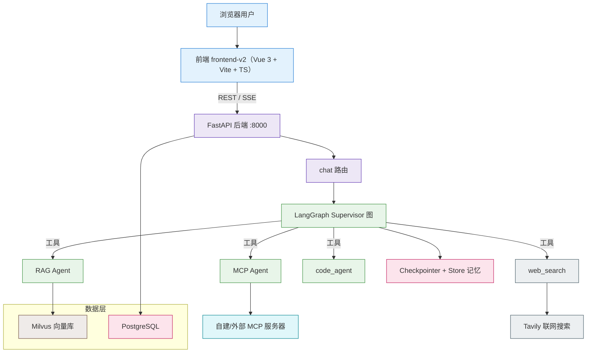
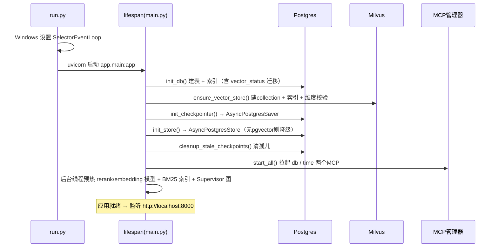
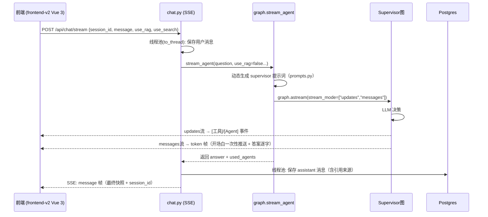

# 📖 Multi-Agent Platform 项目详解（10 分钟总览）

> 相关文档：见 [文档地图](README.md)；函数级细节请读 [DEEP_DIVE](DEEP_DIVE.md)（**唯一深读文档**）。
> 最后校验：2026-08-29（文档与当前代码同步；防漂移检查见 `backend/scripts/check_docs_stale.py`）

从零理解本项目：是什么、怎么组织、怎么跑、核心机制、设计决策。

## 1. 项目定位

一个 **FastAPI + LangGraph + LangChain** 的多 Agent 平台，核心能力是**把用户问题智能路由给不同的专业 Agent**：

- **RAG Agent**：知识库问答（向量检索 + 生成）
- **MCP Agent**：数据库查询、时间计算、外部工具
- **web_search**：Tavily 直接联网搜索工具（非子 Agent）
- **code_agent**：受限沙箱执行 Python（计算 / 算法 / 数据处理）
- **记忆工具**：三层记忆（短期 / 运行时 / 长期）

数据层：**Milvus**（向量库，Postgres 为事实源、派生索引由 `reconcile_vectors` 对账）+ **PostgreSQL**（关系库）。
前端：**`frontend-v2/`（Vue 3 + Vite + TypeScript + Tailwind CSS 4 + Pinia）**，生产构建产物由 FastAPI 托管。
项目 2：**自主任务 Agent（`task-agent/` 独立包）**，见 [AGENT_TASK](AGENT_TASK.md)。

## 2. 技术栈

| 领域 | 技术 | 说明 |
|------|------|------|
| Web | FastAPI + Uvicorn + Pydantic v2 | REST API + SSE 流式 + 静态托管 |
| Agent | LangGraph + LangChain `create_agent` | Supervisor 层级多 Agent |
| 向量库 | Milvus 2.4 + pymilvus 2.4+（MilvusClient 单例）| 文档块向量 + 相似度检索 |
| 关系库 | PostgreSQL 16 + SQLAlchemy 2.x | 会话 / 消息 / 文档元数据（唯一事实源） |
| 记忆 | `AsyncPostgresSaver` + `AsyncPostgresStore` | LangGraph 官方三层记忆 |
| 检索 | 向量 + BM25 + RRF 混合；CrossEncoder rerank | 召回 + 精排 |
| 嵌入 / rerank | sentence-transformers（bge-small-zh / bge-reranker-base）| 本地模型；图像编码见 `image_embedding.py` |
| 联网搜索 | langchain-tavily `TavilySearch` | |
| MCP | mcp SDK 1.x（FastMCP + client）| 自建 stdio + 外部 http |
| LLM | DeepSeek（默认）/ DashScope / OpenAI / Ollama | `llm.py` 工厂 |

## 3. 架构总览



## 4. 启动流程



> Windows 上务必用 `python run.py` 启动（`SelectorEventLoop`），否则 psycopg 异步（Checkpointer/Store）会报错。

## 5. 一次对话的数据流



**流式时序要点**：开场白缓冲后一次性推送（检测 `tool_call`）→ 工具执行 → 答案逐 token，
且经 `streaming.py::_PreludeDedupe` 前缀去重（LLM 常把开场白连同答案重新生成）。

## 6. 核心模块速览（细节见 DEEP_DIVE）

| 模块 | 一句话职责 | DEEP_DIVE |
|------|-----------|-----------|
| `app/agents/` | Supervisor 图（graph.py）+ 工具族包（tools/）+ LLM 工厂 + prompts/streaming | [§4-§5](DEEP_DIVE.md#4-agent-编排-graphpy) |
| `app/rag/` | 摄入（ingestion + extractors + chunkers）→ 混合检索（hybrid + bm25 + rerank）→ 后处理（postprocess） | [§6](DEEP_DIVE.md#6-rag-实现链路-rag) |
| `app/db/` | Postgres CRUD + Checkpointer/Store（三层记忆）+ `vector_status` 对账标记 | [§7](DEEP_DIVE.md#7-记忆实现-dbmemory_storepy) |
| `app/api/` | chat（SSE）/ sessions / rag / memory / auth / tasks / admin / search / agent-tasks | [§8](DEEP_DIVE.md#8-fastapi-部分-apimainpy) |
| `app/mcp_integration/` | MCP 连接管理 + 自建 db/time 服务器 | [§9](DEEP_DIVE.md#9-mcp-集成-mcp_integration) |
| `frontend-v2/` | Vue 3 + SSE 流式渲染 + HITL 确认卡片 + Orbit 轨道 | [§10](DEEP_DIVE.md#10-前端与-sse-交互frontend-v2vue-3) |
| `task-agent/` | 项目 2 独立包（宿主经 `task_agent_adapter.py` 注入） | [AGENT_TASK](AGENT_TASK.md) |

## 7. 关键设计决策

1. **同步 ORM + 线程池**：SQLAlchemy 保持同步，热点路由用 `anyio.to_thread`——不改全异步又不阻塞事件循环；
2. **开关与提示词联动**：工具注册 + system prompt 随 `use_rag/use_search` 动态变化（避免幻觉调用不存在的工具）；
3. **混合检索不依赖 Milvus sparse**：pymilvus 2.4+ 未启用稀疏检索，Python 侧 BM25 + Postgres 文本 + RRF；
4. **Postgres 唯一事实源**：Milvus 是派生索引（`vector_status` 标记 + `sync_chunks` 幂等同步 + `reconcile_vectors` 对账）；
5. **记忆语义检索自动降级**：无 pgvector 时降级关键词检索，服务不中断；
6. **token 级流式**：`astream(stream_mode=["updates","messages"])`，只流式顶层 supervisor 的 AI token。

完整 14 项决策/坑见 [DEEP_DIVE §12](DEEP_DIVE.md#12-关键设计决策与坑)。

## 8. 常用命令

```powershell
docker compose up -d                 # 启动数据库
cd backend; python run.py            # 启动后端（Windows）
python scripts/ingest_docs.py D:\your_docs_folder   # 摄入文档
python scripts/smoke_test.py         # 冒烟（健康 / RAG / MCP / 搜索）
python -m pytest tests/unit -q       # 单元测试
python -m pytest tests/integration -v  # 集成测试（需 DB）
python ../task-agent -m pytest ../task-agent/tests -q  # 项目2 测试
```

## 9. 常见坑

| 问题 | 原因 / 处理 |
|------|------------|
| Windows 下 Checkpointer 报错 | 必须用 `python run.py`（SelectorEventLoop）|
| `extension "vector" is not available` | Postgres 非 pgvector 镜像；重建容器即可（见 SETUP）|
| 关闭知识库开关仍"查到"知识库 | 曾是静态 prompt 导致 LLM 幻觉；已改为动态 prompt |
| MCP 服务器启动失败 | 用 `python run.py` 从 backend 启动（脚本路径相对 backend）|

## 10. 深读指引

- 函数级实现：**[DEEP_DIVE.md](DEEP_DIVE.md)**（配置 → LLM → Agent → RAG → 记忆 → API → MCP → 前端 → Windows 兼容）；
- RAG 设计决策与失败模式：**[RAG_DESIGN_ANALYSIS.md](RAG_DESIGN_ANALYSIS.md)**；
- 评估与基线：**[EVALUATION.md](EVALUATION.md)** + [docs/README.md 唯一基线](README.md)；
- 历史实验：**[EXPERIMENTS.md](EXPERIMENTS.md)**；面试素材：**[interview/](interview/)**；
- 项目 2：**[AGENT_TASK.md](AGENT_TASK.md)** + [task-agent/README](../task-agent/README.md)。
