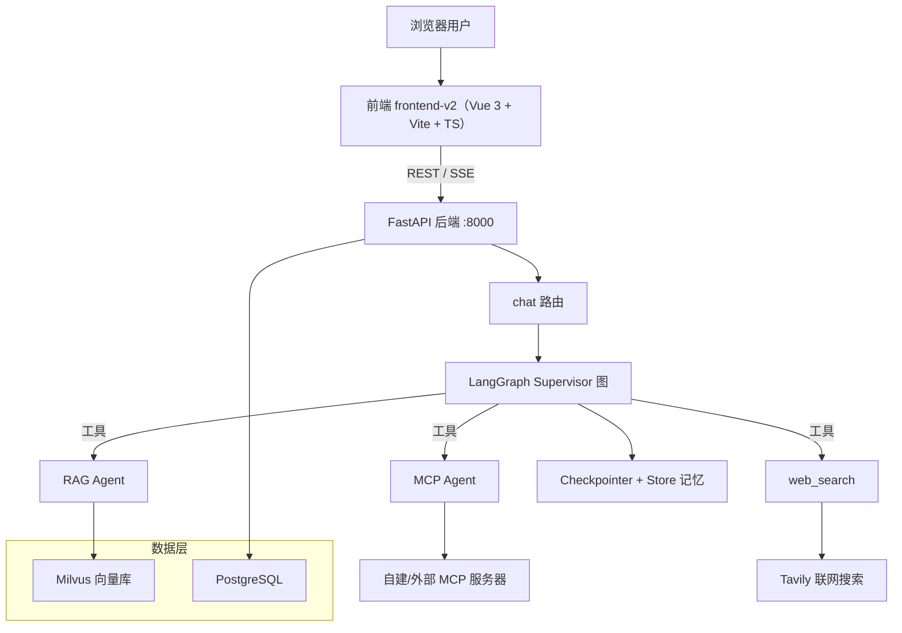
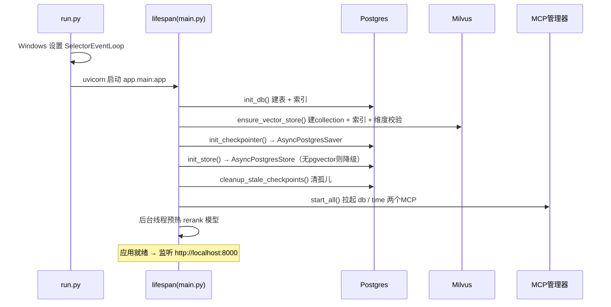
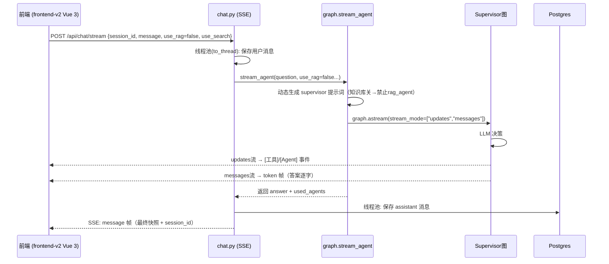
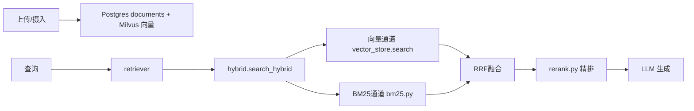
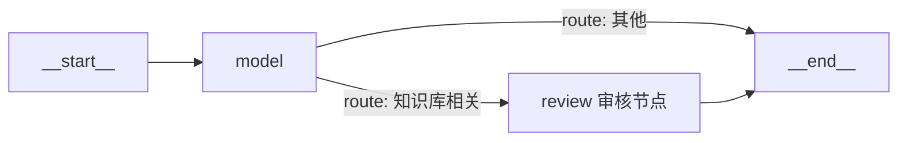
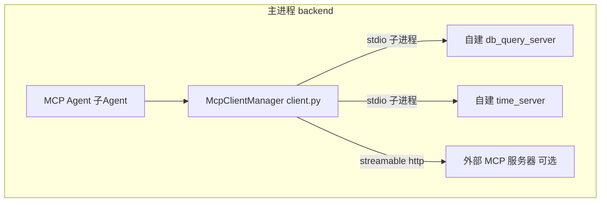
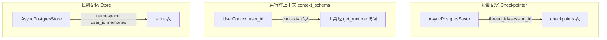
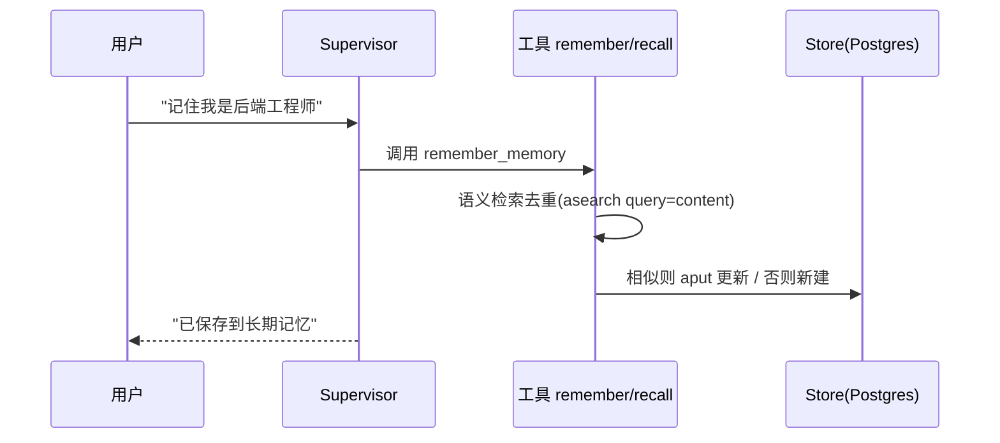
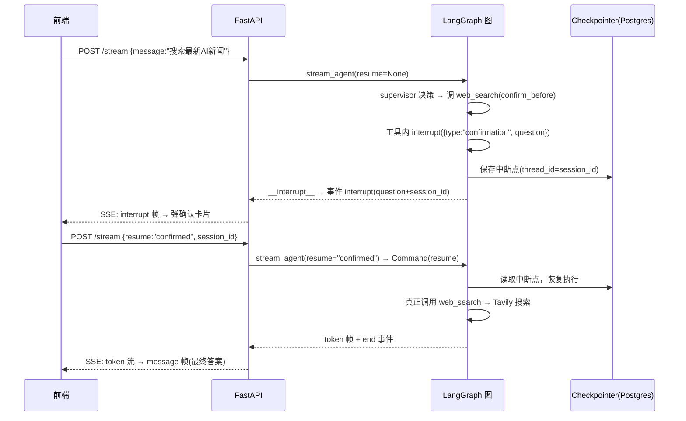

# 📖 Multi-Agent Platform 项目详解

> 从零理解本项目：是什么、怎么组织、怎么跑、核心机制、设计决策。
> 查看方法：打开本文件后按 `Ctrl+Shift+V`（或右上角 ⧉ 图标）进入 Markdown 预览，mermaid 图即可渲染。
>
> 📌 **想深入每一行的实现细节**（Agent 编排、记忆、FastAPI、RAG、MCP 的函数级调用链与设计取舍），请看
> **[《实现详解 DEEP_DIVE》](./DEEP_DIVE.md)**。

---

## 1. 项目定位

一个 **FastAPI + LangGraph + LangChain** 的多 Agent 平台，核心能力是**把用户问题智能路由给不同的专业 Agent**：

- **RAG Agent**：知识库问答（向量检索 + 生成）
- **MCP Agent**：数据库查询、时间计算、外部工具
- **web_search**：Tavily 直接联网搜索工具（非子 Agent）
- **记忆工具**：三层记忆（短期 / 运行时 / 长期）

数据层：**Milvus**（向量库）+ **PostgreSQL**（关系库）。
前端：**`frontend-v2/`（Vue 3 + Vite + TypeScript + Tailwind CSS 4 + Pinia）**，开发用 Vite dev server（:5173），生产构建产物由 FastAPI 托管。

---

## 2. 技术栈

| 领域 | 技术 | 说明 |
|------|------|------|
| Web | FastAPI + Uvicorn + Pydantic v2 | REST API + SSE 流式 + 静态托管 |
| Agent | LangGraph + LangChain `create_agent` | Supervisor 层级多 Agent |
| 向量库 | Milvus 2.4 + pymilvus 3.x（MilvusClient 单例）| 文档块向量 + 相似度检索 |
| 关系库 | PostgreSQL 16 + SQLAlchemy 2.x | 会话 / 消息 / 文档元数据 |
| 记忆 | `AsyncPostgresSaver` + `AsyncPostgresStore` | LangGraph 官方三层记忆 |
| 检索 | 向量 + BM25 + RRF 混合；CrossEncoder rerank | 召回 + 精排 |
| 嵌入 / rerank | sentence-transformers（bge-small-zh / bge-reranker-base）| 本地模型 |
| 联网搜索 | langchain-tavily `TavilySearch` | |
| MCP | mcp SDK 1.x（FastMCP + client）| 自建 stdio + 外部 http |
| LLM | DeepSeek（默认）/ DashScope / OpenAI / Ollama | `llm.py` 工厂 |

---

## 3. 目录结构

```
Agentchat/
├── docker-compose.yml        # Docker Desktop 一键拉起 Postgres + Milvus
├── backend/
│   ├── run.py                # ⭐ 启动入口（Windows 专用 SelectorEventLoop）
│   ├── requirements.txt      # 依赖（mcp 固定 <2.0）
│   ├── .env / .env.example   # 配置（真实 key 在 .env，gitignored）
│   ├── app/
│   │   ├── main.py           # ⭐ FastAPI 入口 + 生命周期初始化
│   │   ├── config.py         # ⭐ 配置中心（pydantic-settings）
│   │   ├── event_loop.py     # Windows SelectorEventLoop factory
│   │   ├── api/routes/
│   │   │   ├── chat.py       #   非流式 + SSE token 级流式对话
│   │   │   ├── sessions.py   #   会话 CRUD + 历史
│   │   │   ├── rag.py        #   文档上传/列表/预览下载/删除/检索测试
│   │   │   ├── memory.py     #   长期记忆 CRUD（语义检索）
│   │   │   └── health.py     #   健康检查
│   │   ├── agents/
│   │   │   ├── graph.py      #   Supervisor 图 + run_agent / stream_agent
│   │   │   ├── tools.py      #   子 Agent 构建 + 记忆工具 + agent_to_tool
│   │   │   ├── llm.py        #   LLM 工厂（provider + 超时/重试）
│   │   │   └── context.py    #   UserContext（运行时上下文 schema）
│   │   ├── rag/
│   │   │   ├── embedding.py  #   嵌入封装（local / openai）
│   │   │   ├── vector_store.py # MilvusClient 单例：schema/索引/检索/维度校验
│   │   │   ├── bm25.py       #   轻量 BM25（自实现，无依赖）
│   │   │   ├── hybrid.py     #   向量 + BM25 + RRF 融合
│   │   │   ├── rerank.py     #   CrossEncoder 精排
│   │   │   ├── retriever.py  #   LangChain 检索器（供 Agent 用）
│   │   │   └── ingestion.py  #   文档解析 + 分块 + 原子摄入
│   │   ├── db/
│   │   │   ├── models.py     #   SQLAlchemy 模型（Session/Message/Document）
│   │   │   ├── postgres.py   #   会话/消息 CRUD + 幂等建索引
│   │   │   └── memory_store.py # ⭐ Checkpointer/Store 全局单例
│   │   ├── mcp_integration/
│   │   │   ├── client.py     #   MCP 连接管理器（stdio + http）
│   │   │   └── servers/
│   │   │       ├── db_query_server.py # 只读 SQL 查询（安全加固）
│   │   │       └── time_server.py     # 时间/计算（AST 白名单）
│   │   └── schemas/chat.py   #   ChatRequest / Response / AgentEvent
│   ├── tests/                # pytest 测试（单元 + API 集成，DB 不可达自动跳过）
│   └── scripts/              # init_db / ingest_docs / smoke_test / MCP 入口
├── frontend/                 # 旧版纯静态前端（已弃用，保留参考）
├── frontend-v2/              # 新版前端（Vue 3 + Vite + TS + Tailwind 4）
├── data/
│   ├── kb/                   # 示例知识库文档
│   └── uploads/              # 网页上传的原始文件（可下载/预览）
└── docs/                     # 说明文档（本文档在此）
```

---

## 4. 架构总览



---

## 5. 启动流程



> 关键：Windows 上必须用 `python run.py` 启动（`SelectorEventLoop`），
> 否则 psycopg 异步（Checkpointer/Store）会因 `ProactorEventLoop` 报错。

---

## 6. 一次对话的数据流

场景：前端发送"帮我统计数据库有多少个会话"（假设知识库开关关闭）。



| 步骤 | 发生什么 | 位置 |
|------|---------|------|
| 1 | 前端发起 SSE 请求 | `frontend-v2: api/index.ts streamChat` |
| 2 | 线程池里保存用户消息（不阻塞事件循环）| `chat.py` |
| 3 | 按开关动态生成 supervisor 提示词 | `graph.py` |
| 4 | `astream` 双模式跑 Supervisor 图 | `graph.py` |
| 5 | Supervisor 调用工具（记忆/数据库/搜索）| `tools.py` |
| 6 | updates → 事件帧；messages → token 帧 | `graph.py → chat.py` |
| 7 | 前端实时追加答案 | `frontend-v2: stores/chat.ts + MessageItem` |
| 8 | 保存回答 + 发最终快照帧 | `chat.py` |
| 9 | 会话 updated_at 刷新 → 排最前 | `postgres.py` |

---

## 7. 核心模块深入

### 7.1 配置中心 `config.py`
- pydantic-settings 从 `.env` 加载
- 连接：Postgres / Milvus 的 DSN（`postgres_dsn` 供 SQLAlchemy，`postgres_conninfo` 供 psycopg）
- LLM：`llm_provider`（默认 deepseek）+ 各 provider key/model + `llm_timeout` / `llm_max_retries`
- 检索：`rag_top_k` / `score_threshold` / `chunk_size` + 混合检索 + rerank
- 记忆：`memory_semantic_search` / `memory_dedup_threshold`
- 健壮性：`agent_timeout`（单轮超时）
- MCP：自建命令 + 外部 `EXTERNAL_MCP_SERVERS`
- CORS 白名单（localhost:8000）

### 7.2 数据库 `db/`
| 文件 | 职责 |
|------|------|
| `models.py` | `sessions`（会话）、`messages`（消息）、`documents`（文档块，每块一行）|
| `postgres.py` | 同步 SQLAlchemy CRUD + `init_db()` 幂等建索引 |
| `memory_store.py` | `AsyncPostgresSaver`（Checkpointer）+ `AsyncPostgresStore`（Store）全局单例 |

> 同步引擎 + `anyio.to_thread`：不改 ORM 为异步，热点路由也不阻塞事件循环。

### 7.3 Agent 编排 `agents/`
- `graph.py`：`get_supervisor_graph()`（构建+缓存）、`_build_supervisor_prompt()`（动态提示词）、`_prepare_run()`（输入组装/Time Travel 分叉）、`run_agent()`（非流式）、`stream_agent()`（token 流式）
- `tools.py`：构建子 Agent、记忆工具（remember 带语义去重）、`agent_to_tool()` 包装
- `llm.py`：LLM 工厂（provider 选择 + 统一超时/重试）
- `context.py`：`UserContext(user_id)` 运行时上下文

### 7.4 RAG 链路 `rag/`


### 7.5 记忆机制（三层）
| 层 | 机制 | 作用域 | 实现 |
|----|------|--------|------|
| 短期 | Checkpointer | 会话内（`thread_id=session_id`）| 图状态跨请求持久 |
| 运行时 | `context_schema=UserContext` | 单次调用 | `context=` 传入，工具经 `get_runtime()` 访问 |
| 长期 | Store `namespace=(user_id,"memories")` | 跨会话 | `remember/recall` 工具 + `/api/memory` 面板 |

### 7.6 MCP 集成
- `client.py`：`AsyncExitStack` 管理连接；自建走 stdio（子进程），外部走 streamable http
- 工具转 `StructuredTool` 并加 `{server}_` 前缀防冲突
- 自建服务器：`db_query_server.py`（只读 SQL 加固）+ `time_server.py`（AST 白名单）

### 7.7 API 路由
| 路由 | 端点 | 职责 |
|------|------|------|
| chat | `/api/chat`、`/api/chat/stream` | 非流式 / SSE token 流式 |
| sessions | `/api/sessions` CRUD + `/batch-delete` + `GET /{id}/checkpoints` | 会话管理 + 历史 + 批量删除（含消息与 checkpoint）+ 版本历史（Time Travel） |
| rag | `/upload`、`/documents`、`/documents/file`、`/search` | 上传/列表/预览下载/删除/检索 |
| memory | `/api/memory` | 长期记忆 CRUD（`?query=` 语义检索）|
| health | `/api/health` | Postgres / Milvus / MCP 健康 |

### 7.8 前端 `frontend-v2/`（Vue 3 + Vite + TypeScript）
- `api/`：统一 HTTP 层（`client.ts` + `token.ts` + `index.ts`，含 `streamChat` SSE）
- `utils/sse.ts`：SSE 流式解析（`ReadableStream` 按 `\n\n` 分帧 → JSON → onEvent）
- `utils/markdown.ts`：marked 单例 + highlight.js 高亮 + DOMPurify 消毒
- `stores/chat.ts`：流式状态机（token 累积 / interrupt→HITL 同气泡 resume / orbit 轨道）
- `components/`：侧边栏（会话/文档/记忆）、聊天区、弹窗（用量/任务/版本历史）、暗/亮主题切换
- Vitest 单测：`src/**/*.{test,spec}.ts`（SSE 解析 / markdown / chat store）

---

## 8. 关键设计决策

1. **同步 ORM + 线程池**：SQLAlchemy 保持同步，热点路由用 `anyio.to_thread`——避免全异步大改，又不阻塞事件循环
2. **开关与提示词联动**：工具注册 + system prompt 都随 `use_rag/use_search` 动态变化（避免 LLM 幻觉调用不存在的工具）
3. **混合检索不依赖 Milvus sparse**：pymilvus 3.0 无 `pymilvus.model`，改用 Python 侧 BM25 + Postgres 文本 + RRF，避免 collection 迁移
4. **记忆语义检索自动降级**：无 pgvector 时降级关键词检索，服务不中断
5. **原始文件持久化**：上传文档存 `data/uploads/`，可下载/预览，删除时清理
6. **token 级流式**：`graph.astream(stream_mode=["updates","messages"])`，只流式顶层 supervisor 的 AI token（`checkpoint_ns` 不含 `|`）

---

## 9. 常见坑与经验

| 问题 | 原因 / 处理 |
|------|------------|
| Windows 下 Checkpointer 报错 | 必须用 `python run.py`（SelectorEventLoop）|
| `extension "vector" is not available` | Postgres 非 pgvector 镜像；重建容器即可（见 SETUP）|
| 关闭知识库开关仍"查到"知识库 | 曾是静态 prompt 导致 LLM 幻觉；已改为动态 prompt |
| 模型缓存占 C 盘 | 已迁移到 `D:\HuggingFaceCache`（Junction + `HF_HOME`）|
| MCP 服务器启动失败 | 用 `python run.py` 从 backend 启动（脚本路径相对 backend）|

---

## 10. 常用命令速查

```powershell
# 启动数据库
docker compose up -d

# 启动后端（Windows）
cd backend; python run.py

# 摄入文档
python scripts/ingest_docs.py D:\your_docs_folder

# 冒烟测试（健康 / RAG / MCP / 搜索）
python scripts/smoke_test.py

# 单元测试（纯逻辑，不依赖外部服务）
pip install -r requirements-dev.txt
python -m pytest tests/ -q

# API 集成测试（需 Docker 依赖运行中；覆盖会话/记忆/RAG/chat/HITL，DB 不可达自动跳过）
python -m pytest tests/test_api.py -v
```

---

## 11. 进阶：手写 StateGraph（add_node / add_edge）

### 什么时候需要手写图

项目用的是 `create_agent()` **高层封装**——它在内部自动构建标准 ReAct 图
（`__start__ → model ⇄ tools → __end__`），你不需要写 `add_node` / `add_edge`。

当你需要**标准 ReAct 之外的复杂编排**时，才需要手写 `StateGraph`：

- 自定义"审核 / 拦截 / 人工确认"节点（答案出来前过一道自定义逻辑）
- 条件路由（按问题类型分流到不同分支）
- 多步骤流水线（先检索 → 再总结 → 再生成）
- 循环 / 重试策略等自定义控制流

### 完整示例（已实测可运行）

```python
from typing import Annotated, TypedDict
from langgraph.graph import END, START, StateGraph
from langgraph.graph.message import add_messages


class State(TypedDict):
    """图的状态：messages 累计消息；final_answer 最终回答。"""
    messages: Annotated[list, add_messages]
    final_answer: str


def model_node(state: State) -> dict:
    """模拟"模型"节点（实际可换成 get_llm()）。"""
    question = state["messages"][-1].content
    if "知识库" in question:
        answer = "根据知识库，退款政策是 7 天内可申请。"
    else:
        answer = "你好，有什么可以帮你？"
    return {"messages": [("assistant", answer)], "final_answer": answer}


def review_node(state: State) -> dict:
    """自定义"审核"节点：改写答案。"""
    return {"final_answer": f"[已审核✓] {state['final_answer']}"}


def route(state: State) -> str:
    """条件路由：知识库相关 → 走 review，否则直接结束。"""
    return "review" if "知识库" in state["final_answer"] else "end"


# 1. 创建图 + 声明状态类型
graph = StateGraph(State)

# 2. add_node：注册节点（每个节点 = 函数: state -> 新的 state 片段）
graph.add_node("model", model_node)
graph.add_node("review", review_node)

# 3. add_edge / add_conditional_edges：连边
graph.add_edge(START, "model")                       # 固定边
graph.add_conditional_edges("model", route, {        # 条件边
    "review": "review",
    "end": END,
})
graph.add_edge("review", END)

# 4. compile()：编译成可执行图（create_agent 内部也是做这一步）
compiled = graph.compile()

# 5. 运行
from langchain_core.messages import HumanMessage

r1 = compiled.invoke({"messages": [HumanMessage("知识库退款政策是什么？")]})
print(r1["final_answer"])  # [已审核✓] 根据知识库，退款政策是 7 天内可申请。
```

### 生成的图结构（mermaid）



> 图中 `model` 节点后是 `route()` **条件路由**：知识库相关的问题走 `review` 审核节点，
> 否则直接结束。这就是手写 `StateGraph` 相比 `create_agent` 多出来的控制能力。

### 与项目现状对比

| | 项目现状（`create_agent`）| 手写 `StateGraph` |
|---|---|---|
| 构建 | 框架自动 `add_node`/`add_edge` | 自己写 |
| 自定义节点 | 只能加"工具" | 可加任意逻辑节点（审核/汇总/分支）|
| 条件路由 | 内置（模型自主决定）| 自己写 `route()` |
| 适用 | 标准 Agent / RAG / 工具 | 复杂流水线 / 人工确认 / 分支 |

---

## 12. MCP 深入

### 12.1 MCP 是什么

**MCP（Model Context Protocol，模型上下文协议）**：一种让 LLM 应用接入外部工具/数据的标准协议。
本项目把它当作"Agent 的工具总线"——通过 MCP 服务器暴露数据库查询、时间计算、外部 API 等能力。

### 12.2 架构



`app/mcp_integration/client.py` 统一管理两类连接：

| 类型 | 传输 | 启动方式 | 说明 |
|------|------|---------|------|
| 自建 | **stdio** | 子进程拉起（FastMCP 实现）| `db_query_server.py` / `time_server.py` |
| 外部 | **streamable http** | `EXTERNAL_MCP_SERVERS` 配置（name=url）| 可选 |

### 12.3 工具转换链路

```
MCP 服务器 → 工具列表(tool.name/description/inputSchema)
          → client.py 转 StructuredTool（工具名加 {server}_ 前缀防冲突）
          → build_mcp_agent() 把工具绑定给 MCP 子 Agent
          → supervisor 通过 mcp_agent 调用
```

关键代码（`client.py`）：

```python
# 1. 建立连接
ctx = stdio_client(StdioServerParameters(command=cmd, args=args))
read, write = await stack.enter_async_context(ctx)
session = await stack.enter_async_context(ClientSession(read, write))
await session.initialize()
tools = (await session.list_tools()).tools

# 2. 转成 LangChain 工具（名称加前缀）
name = f"{server_name}_{mcp_tool.name}"   # 例如 db_query_postgres
args_schema = json_schema_to_pydantic(mcp_tool.inputSchema)
return StructuredTool(name=name, description=..., args_schema=args_schema, coroutine=_arun)
```

### 12.4 自建服务器与安全加固

| 服务器 | 能力 | 安全设计 |
|--------|------|---------|
| `db_query_server.py` | 只读 SQL 查询 / 列表 / 统计 | 连接层 `default_transaction_read_only=on` + `statement_timeout=30s`（终极防护）+ sqlparse 校验（禁分号/DML/pg_ 系统目录）|
| `time_server.py` | 时间 / 计算 | `calculate` 用 **AST 白名单**替代 eval（防任意代码执行）|

### 12.5 如何新增一个 MCP 服务器

**自建**（简单场景）：在 `app/mcp_integration/servers/` 新建脚本，用 FastMCP 暴露工具，
然后到 `client.py` 的 `_builtin_servers()` 注册命令即可。

**外部**（已有服务）：`.env` 配置一行：
```
EXTERNAL_MCP_SERVERS=github=http://localhost:8080/mcp,weather=http://localhost:8081/mcp
```

> 生命周期：应用启动 `start_all()` 拉起全部，关闭 `stop_all()` 用 `AsyncExitStack` 统一清理。

---

## 13. 记忆机制原理

### 13.1 三层记忆总览



| 层 | 机制 | 作用域 | 持久化 |
|----|------|--------|--------|
| 短期 | `AsyncPostgresSaver`（Checkpointer）| 会话内 | ✅ 图状态跨请求 |
| 运行时 | `context_schema=UserContext` | 单次调用 | ❌ 仅当次 |
| 长期 | `AsyncPostgresStore`（Store）| 跨会话 | ✅ namespace 隔离 |

### 13.2 短期记忆（Checkpointer）原理

- 图编译时传 `checkpointer=AsyncPostgresSaver`
- 每次调用带 `config={"configurable": {"thread_id": session_id}}`
- LangGraph 自动把图的**状态**（含 messages 历史）存到 Postgres `checkpoints` 表
- 效果：同一 `thread_id` 的下一轮，图自动恢复历史 → 多轮对话连续

```python
graph = create_agent(..., checkpointer=AsyncPostgresSaver)
await graph.ainvoke({"messages": [...]},
                    config={"configurable": {"thread_id": session_id}})
```

### 13.3 长期记忆（Store）原理

- 图编译时传 `store=AsyncPostgresStore`
- 工具通过 `runtime.store` 读写，namespace 形如 `(user_id, "memories")`
- `aput` 写入 / `asearch` 检索 / `adelete` 删除（跨会话、跨线程持久）

```python
async def _arun(content: str) -> str:
    rt = get_runtime()                 # 工具内获取 Runtime
    user = getattr(rt.context, "user_id", "default")
    await rt.store.aput((user, "memories"), uuid4().hex, {"content": content})
```

**语义检索**：Store 初始化时挂 `IndexConfig`（复用 bge embedding）→ `asearch(query=...)`
按语义相似度召回。需要 Postgres 启用 **pgvector**；无扩展时**自动降级**为关键词检索。

**写入去重**：`remember_memory` 先 `asearch(query=content)` 找相似记忆，
余弦相似度 ≥ `memory_dedup_threshold`（0.86）时**更新该条**而非新增，避免重复。

### 13.4 与 LangGraph 官方机制对齐

项目使用的三层记忆均为 LangGraph **官方机制**（`create_agent` 的参数）：

- Checkpointer → `AsyncPostgresSaver`（官方 `langgraph-checkpoint-postgres`）
- Store → `AsyncPostgresStore` + `IndexConfig`（官方 `langgraph.store`）
- 运行时上下文 → `context_schema` + `get_runtime()`（官方 `langgraph.runtime`）

> 工具的 `get_runtime()` 是 LangGraph 官方公开 API；官方更推荐声明式 `InjectedStore` 参数注入，
> 两者功能等价，本项目用 `get_runtime()` 已实测可用。

### 13.5 完整记忆读写链路



### 13.6 Time Travel（版本历史 / 分叉）

Checkpointer 每执行一步都会落一个 checkpoint，`parent_checkpoint_id` 串成**版本链**。基于它可实现 **Time Travel**：查看会话每一步的历史状态，并**从任意历史点分叉重新生成**。

- **机制**：`config = {"configurable": {"thread_id": sid, "checkpoint_id": cid}}` 时，LangGraph 会从该历史 checkpoint 的状态**继续执行**（即在该点 fork 新分支，不覆盖原历史）。
- **后端**：`graph.py::list_checkpoint_history()` 用 `aget_state_history` 列出快照（checkpoint_id / parent / 时间 / next / 最后AI消息摘要 / 是否中断）；`_prepare_run(..., checkpoint_id)` 在 config 注入分叉点。
- **API**：`GET /api/sessions/{id}/checkpoints` 拉时间线；`/api/chat(/stream)` 请求体 `checkpoint_id` 触发分叉；`resume` 与 `checkpoint_id` 互斥（400）。
- **前端**：会话头部「⏪ 版本历史」→ modal 时间线（#1 最新），每条可「🔄 从这步重跑」→ 输入新消息程序化发送。
- **验证**：多轮对话产生多个 checkpoint；从历史点 fork 后 checkpoint 数量增加（新分支）；无 LLM 时的空历史/冲突校验也有单测覆盖。

## 14. 人工确认（HITL，Human-in-the-Loop）

让 Agent 在执行**有副作用/外部影响**的操作（联网搜索、数据库写入、外部工具）前，暂停等待用户在界面上确认——本质是 LangGraph 官方的 `interrupt` / `Command(resume)` 机制。

### 14.1 机制原理

- **`interrupt(...)`**：在工具内部调用会**暂停图的执行**，返回 `__interrupt__`；当前状态（含未完成的 tool_calls）由 Checkpointer 持久化到 Postgres。
- **`Command(resume=...)`**：带上用户的选择（`confirmed` / `cancelled`）从**同一 `thread_id`** 恢复执行，`interrupt()` 的返回值即 resume 传入的值。
- **状态不丢失**：恢复时 Checkpointer 把整个图状态（历史消息、中断点）装回来，Agent 无缝继续。

### 14.2 一次确认的完整时序



### 14.3 代码实现（三个层面）

**1) 强制确认（`app/agents/tools.py`）**
```python
# 子 Agent 工具（rag/mcp）：agent_to_tool._arun
async def _arun(query: str) -> str:
    if confirm_before:
        choice = interrupt({"type": "confirmation", "question": ..., "data": ...})
        if choice != "confirmed":
            return f"操作已取消：用户未确认调用 {name}。"  # 不执行子 Agent
    result = await agent.ainvoke({"messages": [("user", query)]})
    ...
```
搜索（`build_search_tool`）是**直接 Tavily 工具**，同样支持工具内部 `interrupt` 确认
（`_make_search_arun`，逻辑与上一致）。
`graph.py` 里 `_needs_confirm(action)` 按 `settings.hitl_actions` 决定哪些子 Agent/工具加 `confirm_before=True`。
**HITL 两种模式**：默认 `HITL_ACTIONS=[]` 为 **LLM 自主判定**（注册 `request_confirmation` 工具，由模型判断
何时请求授权，类似 Claude Code/Codex）；配置非空时为**强制确认**，且有前端开关的动作
（search/rag/remember）在开关打开时自动豁免（开关即授权）。

**2) 软性确认（`build_confirmation_tool`）**
当 `HITL_ACTIONS` 为空时注册 `request_confirmation` 工具，supervisor 主动请求确认。
> 设计取舍：`HITL_ACTIONS` 非空时**不注册**该工具——否则 LLM 可能"先 request_confirmation 再触发 confirm_before"造成双重确认。强制确认更可靠。
>
> **可靠性优化**：`_build_supervisor_prompt` 软性分支与工具描述采用**强约束措辞**（"调用 web_search/mcp_agent 之前必须先调用 request_confirmation，绝不要未经确认直接执行"），使 supervisor 对联网搜索/外部工具调用稳定地先请求确认（实测可稳定触发，问题由 supervisor 生成，如"是否同意我进行搜索？"）。

**3) 恢复链路（`app/api/routes/chat.py` + `graph.py`）**
- `ChatRequest.resume` 透传到 `run_agent`/`stream_agent`；非空时用 `Command(resume=resume)`，**跳过**保存用户消息（消息已在历史中）。
- `run_agent`/`stream_agent` 检测 `__interrupt__` → `hitl_pending`，SSE 推 `interrupt` 事件（`chat.py` 补充 `session_id` 供前端 resume 复用同一线程）。
- HITL 等待确认时**不保存空 assistant 消息、不推 `message` 帧**，避免污染会话历史。

### 14.4 前端（`frontend-v2/`）

- `stores/chat.ts::_handleEvent` 统一处理 `token`/`message`/`interrupt`/`start`/`tool`/`end`/`error`；收到 `interrupt` 记录 `hitlMsgId`，气泡内渲染确认卡片（问题 + 确认/取消）。
- 点击后 `resume(choice, sessionId)` 复用**同一消息**（`hitlMsgId`）以 `resume=confirmed|cancelled` + 原 `session_id` 重发 `/api/chat/stream`，轨道在同一气泡内继续（不新建气泡）。

### 14.5 配置（`backend/.env`）

| 变量 | 默认 | 说明 |
|------|------|------|
| `HITL_ENABLED` | `true` | 总开关 |
| `HITL_ACTIONS` | `[]` | 空=LLM 自主判定（默认）；非空（如 `mcp`）=强制确认（逗号分隔：`search`/`rag`/`mcp`/`remember`；有开关的动作开关打开时自动豁免） |

### 14.6 常见坑

- **中断会话勿直接续发新问题**：中断点含"未完成的 tool_calls"消息，若在同一会话直接发新消息（不先确认/取消），把该历史发给 LLM 会触发 400（tool_calls 无对应 tool 消息）。**防护**：`chat.py` 的 `_check_pending_interrupt` 在复用会话发普通新消息前用 `graph.aget_state` 检查是否有 pending interrupt，有则返回 **409 明确提示**（"请先点击上一条的【确认执行/取消】按钮，或新建会话继续"）。应先点确认/取消，或另开新会话。
- **双重确认**：`HITL_ACTIONS` 非空时不要同时期望 supervisor 主动 request_confirmation（本实现已避免注册）。
- **thread_id 一致性**：resume 必须用**同一** `session_id`（= Checkpointer `thread_id`），否则找不到中断点。

