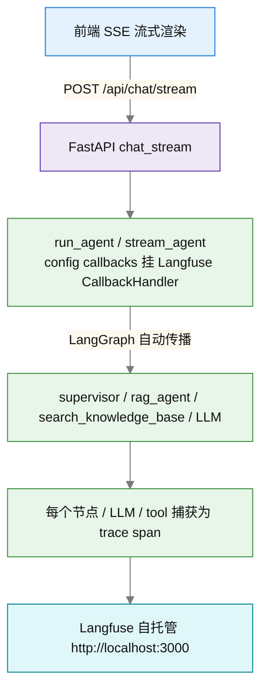

# 可观测性指南（Langfuse 可视 trace）

> 相关文档：[README](../README.md) · [架构文档地图](ARCHITECTURE.md) · [项目2·自主任务Agent](AGENT_TASK.md)

> 目标：让每次对话在 Langfuse 上形成**完整可视化调用链**——
> `supervisor → 子 Agent → 工具 → LLM`，含 token 用量、延迟、检索细节。

---

## 1. 架构



## 2. 部署（自托管）

```powershell
# 1) 启动 Langfuse 全家桶（postgres/redis/clickhouse/minio + web/worker）
docker compose -f docker-compose.langfuse.yml up -d
# 首次初始化约需 20~30 秒；访问 http://localhost:3000

# 2) 预置账号（compose 中 LANGFUSE_INIT_USER_*）：
#    email: admin@langfuse.local  password: admin123456（改 .env 可覆盖）
#    预置项目: agentchat，public/secret key 见 docker-compose.langfuse.yml
```

> **注意**：拉取 `docker.langfuse.com/langfuse/langfuse:4` 等镜像需要能访问外网
> （或配置 Docker 镜像加速）。当前环境网络若不可达，`docker compose up` 会失败——
> 代码已 fail-open，未启用 Langfuse 时后端完全不受影响。

## 3. 后端配置（backend/.env）

```ini
LANGFUSE_HOST=http://localhost:3000
LANGFUSE_PUBLIC_KEY=pk-lf-agentchat-dev
LANGFUSE_SECRET_KEY=sk-lf-agentchat-dev
```

三个变量**全部配置**后才启用；任一为空则自动禁用（fail-open，零侵入）。
启用后**无需重启**——`get_langfuse_handler()` 每次 invocation 时惰性创建。

## 4. 接入点（代码位置）

| 位置 | 作用 |
|------|------|
| `app/observability.py` | handler 工厂 + fail-open + flush |
| `app/agents/graph.py::_prepare_run` | 每次 invocation 在 config 挂 `callbacks`（不写进 lru 缓存的图实例，避免跨会话复用） |
| `app/main.py::lifespan` | 关闭时 `flush_langfuse()`，确保尾部 trace 不丢 |
| `app/config.py` | `langfuse_host / public_key / secret_key` 配置字段 |

## 5. 验证

1. 启动 Langfuse + 后端后，在界面发一条会触发 RAG 的问题（如"公司有多少名员工"）；
2. 打开 `http://localhost:3000` → agentchat 项目 → Traces：
   - 应看到一条完整 trace：`supervisor(LLM) → rag_agent(子Agent) → search_knowledge_base(工具) → LLM 调用`；
   - 每个 span 含输入/输出、token 用量、延迟；
3. 若 UI 里没有新 trace：检查 `backend/.env` 三个变量是否齐全、Langfuse 容器是否 healthy。

## 6. 已知限制

- **AGENT_CACHE_ENABLED=true** 时，命中缓存的调用不产生 LLM 调用（trace 会偏短）——属预期；深度调试时建议临时关缓存。
- 检索内部数值（BM25/RRF 分数）目前未手动埋 span，trace 只到"工具调用"级别；如需检索细节可后续在 `hybrid.search_hybrid` / `rerank` 内加 span。
